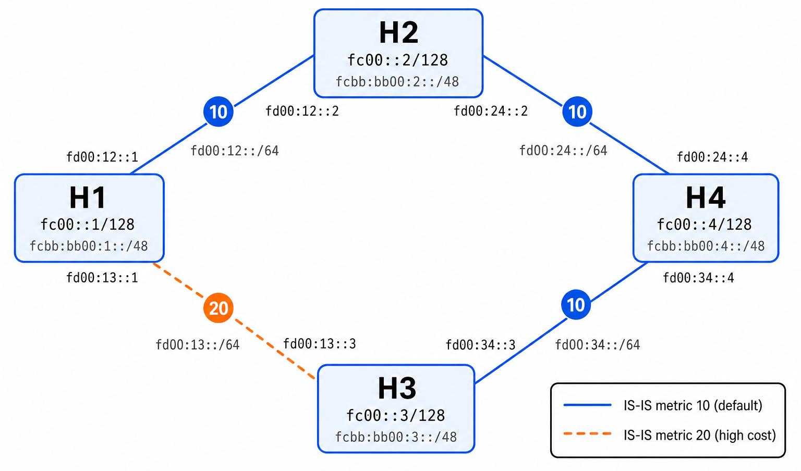
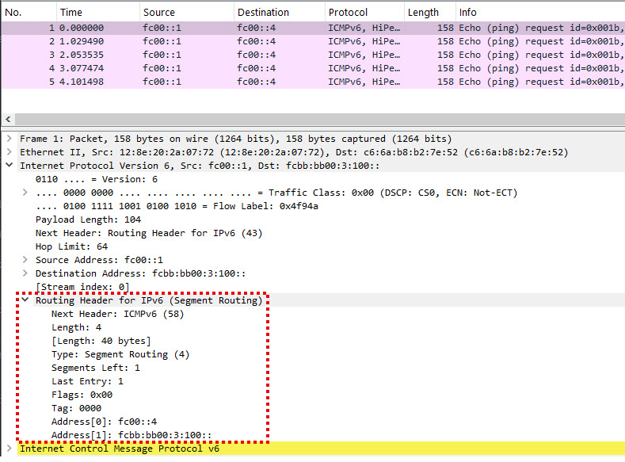

# SRv6 Lab

A hands-on lab for learning Segment Routing over IPv6 (SRv6) with FRRouting (FRR) inside Docker containers. It builds a four-node network running IS-IS with SRv6 extensions, letting you observe SRv6 SID distribution, default shortest-path routing, and explicit source routing with the Segment Routing Header (SRH) — all without physical hardware. The setup is fully automated: build one Docker image, bring up the containers, and IS-IS converges with SRv6 SIDs on its own.

> For background on SRv6 architecture, SID structure, endpoint behaviors, and compressed SIDs, see the [SRv6 primer](docs/SRv6_PRIMER.md). For MPLS and SR-MPLS basics, see the [MPLS primer](docs/MPLS_PRIMER.md).

## Prerequisites

- **Docker Engine** (v20.10 or later) with the `docker compose` plugin.

- **Linux host kernel with SRv6 support.** Docker containers share the host kernel, and FRR is control plane only — it computes routes and distributes SRv6 SIDs, but the **Linux kernel** does the actual packet forwarding. The SRv6 data plane requires these kernel options to be enabled:

  | Kernel option | What it does |
  |---------------|-------------|
  | `CONFIG_LWTUNNEL` | Lightweight tunnels — required for all `encap` route types |
  | `CONFIG_IPV6_SEG6_LWTUNNEL` | SRv6 lightweight tunnel support — `encap seg6` and `seg6local` actions |

  Most desktop and server Linux distributions (Ubuntu, Fedora, Arch) ship kernels with these options enabled. **WSL2's default kernel does not include them** — you will need a [custom WSL2 kernel](https://learn.microsoft.com/en-us/windows/wsl/wsl-config#configure-a-custom-linux-kernel) compiled with the options above. Without them, the IS-IS control plane still works (adjacencies form, SRv6 SIDs are distributed) but the SRv6 source-routing experiment in the data plane will fail.

  To check your kernel:

  ```bash
  # WSL2 (config is in /proc)
  zcat /proc/config.gz 2>/dev/null | grep -E "CONFIG_LWTUNNEL|CONFIG_IPV6_SEG6_LWTUNNEL"

  # Ubuntu / standard Linux VM (config is in /boot)
  grep -E "CONFIG_LWTUNNEL|CONFIG_IPV6_SEG6_LWTUNNEL" /boot/config-$(uname -r)
  ```

  Both should show `=y` or `=m`.

- **Bridge netfilter disabled.** Docker's default bridge networking passes IPv6 packets through `ip6tables`, which can silently drop packets with an SRv6 Routing Header. Before running the SRv6 experiment, disable bridge netfilter:

  ```bash
  sudo sysctl -w net.bridge.bridge-nf-call-ip6tables=0
  ```

  Without this, the IS-IS control plane works fine (it runs on Layer 2, bypassing the bridge filter), but SRv6 data-plane packets between containers will be dropped.

- Basic familiarity with the Linux command line.
- No physical routers or switches are needed.


## Key Concepts

### SRv6 in FRR

[FRRouting](https://frrouting.org/) (FRR) is the open-source routing suite used in this lab. FRR supports SRv6 through two IGP options:

| IGP | SRv6 support | Maturity in FRR |
|-----|-------------|-----------------|
| **IS-IS** | Full — locators, automatic SID allocation, End/End.X behaviors | Production-ready (since FRR 7.5+) |
| **OSPFv3** | Partial — basic SRv6 extensions | Experimental, fewer features |

### Why IS-IS (Not OSPF) for This Lab

The previous labs ([FRR-LabNet](https://github.com/ManiAm/FRR-LabNet), [BFD-LabNet](https://github.com/ManiAm/BFD-LabNet)) used OSPF because it was the right tool for learning basic routing and BFD. For SRv6, this lab switches to IS-IS for three reasons:

1. **FRR maturity.** FRR's SRv6 implementation is built on IS-IS. The IS-IS SRv6 code path is well-tested and feature-complete; OSPFv3 SRv6 is still experimental.

2. **Real-world alignment.** The major SRv6 deployments — SoftBank, China Mobile, hyperscaler AI fabrics — all run IS-IS. Learning IS-IS + SRv6 together reflects how production networks actually work.

3. **Protocol fit.** IS-IS runs directly on Layer 2 (it does not need IP to bootstrap), and its TLV-based encoding makes it straightforward to add new extensions like SRv6 locators. OSPF's LSA structure is less flexible for carrying arbitrary SRv6 data.

### IS-IS Essentials for This Lab

If you are new to IS-IS: it is a link-state routing protocol, just like OSPF. Every router floods a description of its links to every other router, all routers build the same topology map, and each one independently runs the shortest-path algorithm. The concepts you learned with OSPF — neighbors, adjacencies, convergence, link-state database — all apply. The main visible differences are the addressing (IS-IS uses ISO NET addresses instead of router IDs) and the terminology (IS-IS calls its hello packets IIH, and its link-state entries LSPs rather than LSAs).

Two IS-IS specifics appear in this lab's configuration:

- **NET (Network Entity Title).** A NET is IS-IS's equivalent of a router ID — an ISO address in the format `<area>.<system-ID>.<selector>`. In this lab, H1's NET is `49.0001.0000.0000.0001.00`, which breaks down as:
  - `49.0001` — the IS-IS area (area 49.0001, shared by all four routers)
  - `0000.0000.0001` — the system ID (unique per router — `...0001` for H1, `...0002` for H2, etc.)
  - `00` — the selector (always `00` for a NET, meaning "the router itself")

- **IS-IS levels.** IS-IS defines two routing levels: **Level 1** (intra-area, similar to OSPF intra-area routes) and **Level 2** (inter-area, similar to OSPF backbone routes). A single router can be Level-1-only, Level-2-only, or both. This lab uses `is-type level-1` because all four routers are in the same area and inter-area routing is not needed.

### SRv6 Locators and End SIDs

Each router is configured with an SRv6 **locator** — a /48 IPv6 prefix that the router owns. For example, H1's locator is `fcbb:bb00:1::/48`. The locator is advertised by IS-IS, so every router in the network can route toward it.

FRR automatically allocates **End SIDs** from each router's locator. An End SID is the SRv6 equivalent of a Node SID: it says "forward this packet to me, then process the next segment." When IS-IS converges, every router knows every other router's End SID — this is what makes SRv6 source routing possible.

You do not configure SIDs by hand. FRR allocates them, IS-IS distributes them, and you discover them with `show isis segment-routing srv6 node`.


## Lab Topology

The lab creates four containers in a **diamond** topology connected by four Docker bridge networks:



| Container | Networks | IPv6 Addresses | Loopback | SRv6 Locator |
|-----------|----------|----------------|----------|--------------|
| **H1** | link_h1_h2, link_h1_h3 | fd00:12::1, fd00:13::1 | fc00::1/128 | fcbb:bb00:1::/48 |
| **H2** | link_h1_h2, link_h2_h4 | fd00:12::2, fd00:24::2 | fc00::2/128 | fcbb:bb00:2::/48 |
| **H3** | link_h1_h3, link_h3_h4 | fd00:13::3, fd00:34::3 | fc00::3/128 | fcbb:bb00:3::/48 |
| **H4** | link_h2_h4, link_h3_h4 | fd00:24::4, fd00:34::4 | fc00::4/128 | fcbb:bb00:4::/48 |

**IS-IS link metrics:** All links use the default metric of 10, except the H1–H3 link which is set to 20 on both sides. This makes the default shortest path from H1 to H4 always go through **H2** (total cost 20) rather than H3 (total cost 30). The SRv6 experiment then overrides this by source-routing traffic through H3.

> **Note on interface names:** Docker Compose does not guarantee the order of interface names (`eth0`, `eth1`) inside containers. The entrypoint script detects each interface by its IPv6 address and generates the correct IS-IS configuration at startup. Use `ip -6 addr show` inside any container to see the actual mapping.

**Why a diamond?** Two parallel paths between H1 and H4 create a clear contrast: default routing picks one path, SRv6 lets you pick the other. The topology also supports future experiments — TI-LFA (break a link, observe the backup segment list), SRv6 Policy, and BGP L3VPN over SRv6 (add VRFs on the edge nodes).


## Quick Start

Build the Docker image:

```bash
docker build --tag frr-srv6 docker/
```

Start the containers:

```bash
docker compose -f docker/docker-compose.yml up -d
```

IS-IS will converge and SRv6 SIDs will be distributed within a few seconds. Jump to [Verify the Lab](#verify-the-lab) to confirm.


## How the Lab Works

### Startup

The entrypoint script (`docker/entrypoint.sh`) runs inside each container at startup:

1. Enables IPv6 forwarding (`net.ipv6.conf.all.forwarding=1`).
2. Enables the SRv6 data plane (`net.ipv6.conf.*.seg6_enabled=1`) on all interfaces. This kernel setting allows the interface to receive and process SRv6 packets — specifically, `seg6local` actions like End and End.X that operate on the Segment Routing Header.
3. Detects which interface carries which subnet (Docker interface naming is non-deterministic).
4. Generates the FRR configuration with the correct interface names and IS-IS metrics.
5. Starts FRR, which launches `zebra` (the route manager that installs routes into the Linux kernel) and `isisd` (the IS-IS daemon).
6. Configures the SRv6 locator via `vtysh` after FRR is running. `vtysh` is FRR's unified command-line shell — similar to a Cisco IOS CLI — that lets you query and configure all FRR daemons from a single interface.

### Configuration Files

The configuration files live under `docker/configs/`:

```text
docker/configs/
├── daemons                # shared — enables zebra and isisd
├── frr-H1/frr.conf        # reference: loopback fc00::1, IS-IS, SRv6 locator
├── frr-H2/frr.conf        # reference: loopback fc00::2, IS-IS, SRv6 locator
├── frr-H3/frr.conf        # reference: loopback fc00::3, IS-IS, SRv6 locator
└── frr-H4/frr.conf        # reference: loopback fc00::4, IS-IS, SRv6 locator
```

The `daemons` file is the only configuration applied directly — it tells FRR which daemons to start (zebra and isisd). The per-node `frr.conf` files are **reference copies** that show the expected final configuration for each router; the entrypoint script generates the actual `/etc/frr/frr.conf` dynamically at startup because interface names are not known until the container is running.

### Modifying the Configuration

Edit the entrypoint script or the reference `frr.conf` files, rebuild the image, and recreate the containers:

```bash
docker build --tag frr-srv6 docker/
docker compose -f docker/docker-compose.yml up -d --force-recreate
```

You can also make live changes with `vtysh` (e.g., `docker exec -it H1 vtysh`), but those changes are lost when the container restarts.


## Verify the Lab

### Check IS-IS Adjacencies

Enter H1 and confirm IS-IS neighbors are up:

```bash
docker exec H1 vtysh -c "show isis neighbor"
```

H1 should show two adjacencies — H2 and H3:

```
Area SRv6LAB:
  System Id           Interface   L  State        Holdtime SNPA
  H2                  eth0        1  Up            29       ...
  H3                  eth1        1  Up            29       ...
```

> The interface names above (`eth0`, `eth1`) are examples. Your container may assign them in a different order. What matters is that both H2 and H3 appear with state `Up`.

### Check SRv6 SIDs

View the SRv6 SIDs that IS-IS has distributed across all nodes:

```bash
docker exec H1 vtysh -c "show isis segment-routing srv6 node"
```

Each node should appear with its SRv6 capabilities. View the IS-IS routes to see the SRv6 locators and auto-allocated End.X SIDs:

```bash
docker exec H1 vtysh -c "show ipv6 route isis"
```

You should see routes to each node's locator (e.g., `fcbb:bb00:2::/48`, `fcbb:bb00:3::/48`) and local `seg6local End.X` entries for this node's own SIDs.

You can also view the local SID table:

```bash
docker exec H1 vtysh -c "show segment-routing srv6 locator"
```

### Check Default Routing

Verify that H1 reaches H4 via the shortest path (through H2):

```bash
docker exec H1 traceroute6 -s fc00::1 fc00::4
```

Expected output shows two hops — H2 then H4:

```
 1  fd00:12::2 (fd00:12::2)    ...    (H2)
 2  fc00::4 (fc00::4)          ...    (H4)
```

The path goes H1 → H2 → H4 (cost 20), not through H3 (cost 30).

### End-to-End Ping

```bash
docker exec H1 ping -6 -c 3 -I fc00::1 fc00::4
```

All three pings should succeed, confirming the full routing path through IS-IS.


## Experiment: SRv6 Source Routing

> **Kernel requirement:** This experiment uses `ip route encap seg6`, which requires `CONFIG_LWTUNNEL` and `CONFIG_IPV6_SEG6_LWTUNNEL` in the host kernel. See [Prerequisites](#prerequisites). If your kernel lacks these options, you can still observe the IS-IS control plane (SID distribution, route computation) but cannot perform data-plane source routing.

This experiment overrides the default shortest path. Instead of H1 → H2 → H4 (the IS-IS default), you force the packet through H3 using an SRv6 segment list.

### Step 1 — Confirm the Default Path

If you have not already done so in [Check Default Routing](#check-default-routing), verify that H1's path to H4 goes through H2:

```bash
docker exec H1 traceroute6 -s fc00::1 fc00::4
```

The first hop is H2 (`fd00:12::2`). This is IS-IS choosing the lowest-cost path.

### Step 2 — Create an End SID on H3

FRR automatically allocates **End.X** SIDs (cross-connect SIDs that forward to a specific adjacency). However, End.X SIDs use link-local next-hops internally, and older kernels (including 5.15) have a known limitation where the `seg6local` input route lookup cannot resolve a link-local next-hop across a different interface than the one the packet arrived on.

Instead, we create a manual **End** SID on H3. The End behavior updates the IPv6 Destination Address from the SRH and then performs a standard route lookup — which works reliably on all kernel versions.

First, find the interface on H3 that faces H1 (the `fd00:13::` subnet):

```bash
docker exec H3 ip -o -6 addr show | grep fd00:13
```

Use the interface name from the output (shown as `eth1` below — yours may differ) in the following command:

```bash
docker exec H3 ip -6 route add fcbb:bb00:3:100::/128 \
    encap seg6local action End dev eth1
```

> The `dev` parameter must be the interface on which the SRv6 packet will **arrive** (i.e., the interface facing H1).

### Step 3 — Add the SRv6 Source Route

Replace the default route to H4's loopback with an SRv6-encapsulated route that visits H3 first:

```bash
docker exec H1 ip -6 route replace fc00::4/128 \
    encap seg6 mode inline segs fcbb:bb00:3:100:: via fd00:13::3
```

This tells the Linux kernel: "For packets to `fc00::4`, insert a Segment Routing Header with H3's End SID, and send via H3's directly connected address."

The command uses `mode inline`, which inserts the SRH directly into the **original** packet rather than wrapping it in an outer IPv6 header. The alternative, `mode encap`, would add a new outer IPv6 header around the original packet (IPv6-in-IPv6 encapsulation). Inline mode is simpler for this experiment because it avoids the overhead of an extra 40-byte header — the original packet is modified in place:

- The **Destination Address** is overwritten with H3's End SID (`fcbb:bb00:3:100::`)
- The **SRH** stores the original destination (`fc00::4`) so it can be restored at H3
- The original packet is not encapsulated — there is no outer header

### Step 4 — Verify the New Path

```bash
docker exec H1 traceroute6 -s fc00::1 fc00::4
```

The first hop is now **H3** (`fd00:13::3`) instead of H2. The packet takes the longer path because you told it to:

```
 1  fd00:13::3 (fd00:13::3)    ...    (H3 — forced by SRv6)
 2  fc00::4 (fc00::4)          ...    (H4)
```

```bash
docker exec H1 ping -6 -c 3 -I fc00::1 fc00::4
```

All pings should succeed, confirming end-to-end delivery through the SRv6-dictated path.

### Step 5 — Capture the SRH

Capture SRv6 packets arriving at H3. First, find the interface on H3 that faces H1 (the same interface used in Step 2):

```bash
docker exec H3 ip -o -6 addr show | grep fd00:13
```

Use that interface name (shown as `eth1` below) to capture packets with a Routing Header (protocol 43):

```bash
docker exec H3 tcpdump -i eth1 -n -vv -c 2 "ip6 proto 43"
```

In a second terminal, send pings:

```bash
docker exec H1 ping -6 -c 2 -I fc00::1 fc00::4
```

You should see the Segment Routing Header in the capture:

```
fc00::1 > fcbb:bb00:3:100:: : srcrt (len=4, type=4, segleft=1)
```

You can also capture the **outbound** side on H3 (toward H4) to see the packet after End processing. Find the interface facing H4:

```bash
docker exec H3 ip -o -6 addr show | grep fd00:34
```

Then capture on that interface (shown as `eth0` below):

```bash
docker exec H3 tcpdump -i eth0 -n -vv -c 2 "host fc00::4"
```

After End SID processing, the packet's Destination Address is restored to `fc00::4` and `segments_left` is decremented to 0:

```
fc00::1 > fc00::4 : srcrt (len=4, type=4, segleft=0)
```

This is the SRH from the [SRv6 primer's packet walk](docs/SRv6_PRIMER.md#srv6-packet-walk--step-by-step) made real.

To inspect the packets visually, you can re-run the capture with `-w` to save a pcap file (e.g., `tcpdump -i eth1 -n -w /tmp/srh.pcap -c 5 "ip6"`) and open it in Wireshark. The dissection shows the full SRH structure inside each packet:



The dissection confirms every field from the primer:

- **IPv6 header**: Source `fc00::1` (H1), Destination `fcbb:bb00:3:100::` (H3's End SID — the active segment). Next Header is **43** (Routing Header for IPv6).
- **Routing Header (Segment Routing)**: Type **4** (SRv6), **Segments Left = 1** (one segment still to process), **Last Entry = 1** (two entries in the list, indexed 0 and 1). The segment list is stored in reverse order — `Address[0]: fc00::4` is the final destination and `Address[1]: fcbb:bb00:3:100::` is the first segment (H3's End SID).
- **ICMPv6 Echo Request**: The original ping payload, carried after the SRH.

### Step 6 — Remove the SRv6 Route

Restore default IS-IS routing:

```bash
docker exec H1 ip -6 route del fc00::4/128
docker exec H3 ip -6 route del fcbb:bb00:3:100::/128
```

Verify the path reverts to H2:

```bash
docker exec H1 traceroute6 -s fc00::1 fc00::4
```

### What Just Happened

| State | Path H1 → H4 | Why |
|-------|---------------|-----|
| **Before** (IS-IS default) | H1 → **H2** → H4 | IS-IS shortest path (cost 20) |
| **During** (SRv6 source route) | H1 → **H3** → H4 | Segment list forces the packet through H3's End SID |
| **After** (route removed) | H1 → **H2** → H4 | IS-IS default restored |

The IS-IS control plane never changed. The SRv6 source route on H1 overrode the forwarding decision for that one prefix, exactly as described in the primer: *the path lives in the packet, not in the routers.*


## Troubleshooting

| Symptom | Cause | Fix |
|---------|-------|-----|
| `ip route encap seg6` fails with "CONFIG_LWTUNNEL is not enabled" | Host kernel lacks SRv6 support | Use a kernel compiled with `CONFIG_LWTUNNEL=y` and `CONFIG_IPV6_SEG6_LWTUNNEL=y`. WSL2's default kernel does not include these. |
| SRv6 ping 100% loss but IS-IS works | Docker bridge netfilter drops SRH packets | Run `sudo sysctl -w net.bridge.bridge-nf-call-ip6tables=0` on the host |
| End.X SID returns "Address unreachable" | Kernel 5.15 cannot resolve End.X link-local nexthop from a different ingress interface | Use a manual `End` SID instead of the auto-allocated `End.X` (see the experiment steps above) |
| Interface names differ from examples | Docker Compose does not guarantee interface ordering | Use `ip -o -6 addr show` inside the container to find the correct interface for each subnet |


## Cleanup

```bash
docker compose -f docker/docker-compose.yml down
```
