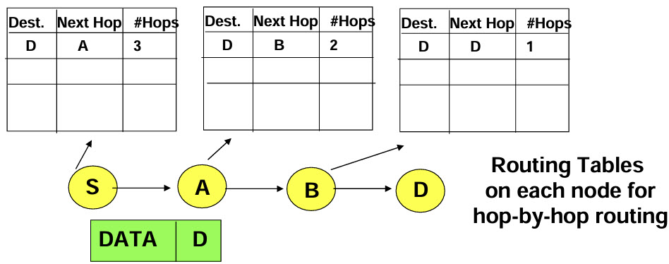
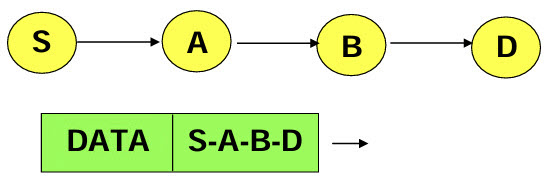
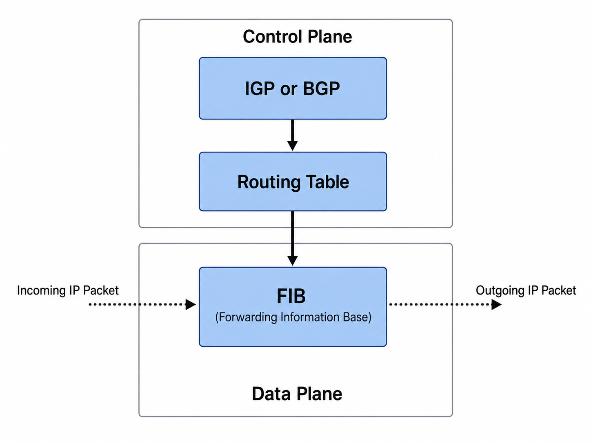
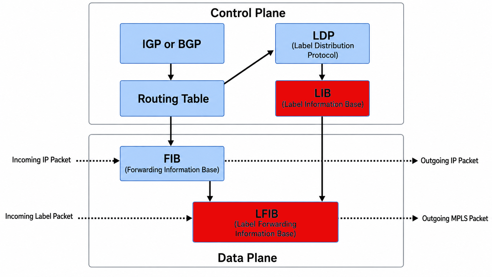
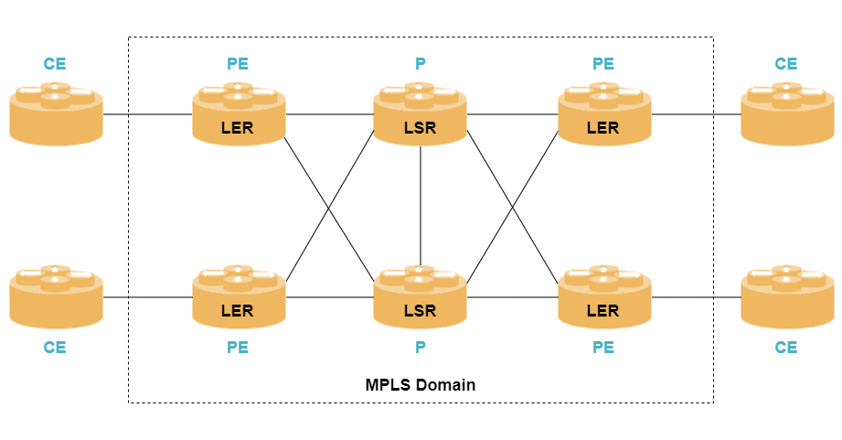
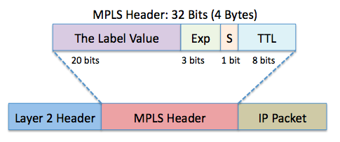
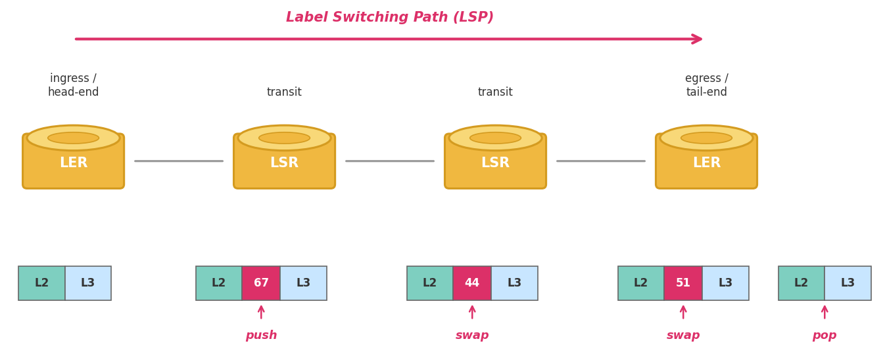
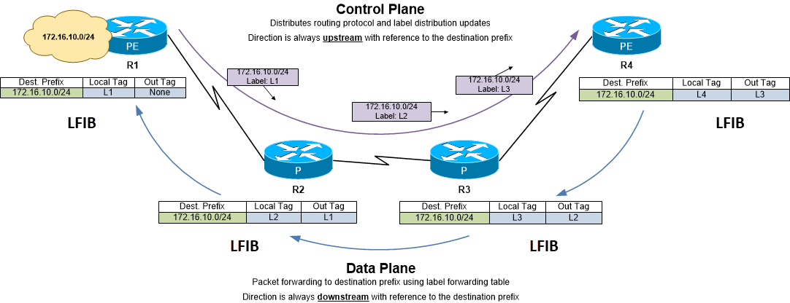

# IP Routing and MPLS

## The Problem: How Do Packets Find Their Path?

When a packet travels from point A to point Z across a network, it passes through many intermediate routers. Each router must decide: *which port do I send this packet out of?* There are two fundamentally different approaches to making that decision.

### Hop-by-Hop Routing (The Traditional Way)

In traditional IP routing, every router makes its own independent forwarding decision. The packet header says only *where* it wants to go (the destination address). Each router along the way consults its own routing table — built by Interior Gateway Protocols (IGPs) such as OSPF (Open Shortest Path First) or IS-IS (Intermediate System to Intermediate System) for intra-domain routing, or BGP (Border Gateway Protocol) for inter-domain routing — picks the best next hop, and forwards the packet. No router knows or cares about the full path; it only knows the next step.

This works well for most traffic, but it has a limitation: **the sender has no control over the path**. Traffic always follows the shortest path calculated by the routing protocol. If the sender wants traffic to take a specific route — perhaps to avoid a congested link, to traverse a particular firewall, or to balance load across parallel paths — it has no way to express that in a standard IP packet.

### Source Routing (The Alternative)

In source routing, the **sender** specifies the path. The packet header contains an ordered list of waypoints that the packet must visit, in sequence. Each intermediate router simply follows the instruction for its hop and forwards the packet to the next waypoint. No router needs to compute anything — the path is predetermined.

Source routing is an old idea. IPv4 included Loose Source and Record Route (LSRR) and Strict Source and Record Route (SSRR) options dating back to RFC 791 in 1981. However, these were rarely used and eventually filtered by most routers due to security concerns. **Segment Routing is the modern, production-grade reinvention of source routing** — see the [SRv6 primer](SRv6_PRIMER.md).

## Control Plane, Data Plane, and MPLS

This section introduces two foundational terms — control plane and data plane — and the technology that Segment Routing replaces: MPLS and its associated signaling protocols.

### Control Plane vs. Data Plane

Every router has two conceptual layers:

- **Control plane:** The "brain." It runs routing protocols (OSPF, IS-IS, BGP), exchanges topology information with neighboring routers, and builds the forwarding table that tells the router where to send packets.

- **Data plane:** The "muscle." It takes each incoming packet, looks up the destination in the forwarding table, and sends the packet out the correct port. The data plane operates at **line rate** (processing every packet at the full speed of the incoming port) — often in dedicated hardware — and handles billions of packets per second.

In a standard IP router, the control plane populates the **RIB (Routing Information Base)** — the master routing table built from all routing protocols. The data plane uses a streamlined copy of the RIB called the **FIB (Forwarding Information Base)** to make fast per-packet forwarding decisions. For a hands-on look at how a real routing stack manages the RIB and FIB, see the [RIB and FIB section of the FRR-LabNet project](https://github.com/ManiAm/FRR-LabNet/blob/master/FRRouting.md#rib-and-fib).

### What Is MPLS?

**Multiprotocol Label Switching (MPLS)** is a forwarding technology that routes packets using short, fixed-length **labels** instead of performing a full IP destination-address lookup at every hop. Looking up a 20-bit label is simpler — and was historically faster — than doing a longest-prefix match on a 32-bit or 128-bit IP address.

An MPLS-capable router extends the standard RIB/FIB architecture with two additional tables. In the control plane, a label distribution protocol (LDP or RSVP-TE — described later in this section) populates the **LIB (Label Information Base)**, the table of label bindings. In the data plane, the RIB combined with the LIB produces the **LFIB (Label Forwarding Information Base)** used to forward labeled MPLS packets, alongside the FIB used for plain IP packets. The diagram below shows how all four tables relate:

#### The MPLS Domain

An MPLS network is organized into a clearly defined **MPLS domain** — the set of routers that understand and forward labeled packets. Routers outside the domain send and receive ordinary IP packets and never see an MPLS label. Several roles exist inside and around the domain:

- **CE (Customer Edge):** A router on the customer's side of the network. It speaks plain IP to the provider and knows nothing about MPLS.

- **PE (Provider Edge) / LER (Label Edge Router):** The border router between the customer network and the MPLS domain. It has two jobs: (1) receive an incoming IP packet from the CE and *push* one or more MPLS labels onto it — this is where the packet enters the MPLS world; (2) at the far side, *pop* the last label and deliver a plain IP packet back to the destination CE. Because it sits at the edge, it must understand both IP routing and MPLS label operations.

- **P (Provider) / LSR (Label Switching Router):** A core router inside the MPLS domain. It never looks at the IP header. It reads the topmost MPLS label, looks it up in its **LFIB**, *swaps* it for a new outgoing label, and forwards the packet out the correct port. This swap-and-forward operation is why MPLS forwarding is fast — the core routers do the absolute minimum.

In summary: `CEs` talk IP, `PEs` translate between IP and MPLS, and `P` routers forward purely on labels.

#### The MPLS Packet Format

An MPLS packet is *not* a different kind of packet — it is a normal IP packet with an MPLS **label stack** inserted between the Layer 2 (Ethernet) header and the Layer 3 (IP) header. This is why MPLS is sometimes called a "Layer 2.5" protocol: it sits between the data-link and network layers.

Each label stack entry is **4 bytes (32 bits)** and contains four fields:

| Field | Bits | Purpose |
|-------|------|---------|
| **Label** | 20 | The forwarding instruction — the value the router looks up in its LFIB |
| **Exp / TC** | 3 | Traffic Class — used for QoS (Quality of Service) priority marking |
| **S** | 1 | Bottom-of-Stack flag — set to **1** on the last (deepest) label in the stack, **0** on all others |
| **TTL** | 8 | Time to Live — decremented at each hop to prevent loops, just like the IP TTL |

Multiple label entries can be **stacked** on top of each other. The router always processes the **topmost** label. The S bit tells it when it has reached the bottom of the stack and the IP header begins underneath.

The original IP packet — with its TCP or UDP header and payload — is completely intact underneath the label stack. MPLS wraps around it without modifying it.

#### Label Operations and the LSP

When labels are in use, the path a labeled packet follows from ingress to egress is called a **Label Switched Path (LSP)**. An LSP is unidirectional: it goes one way from the ingress PE to the egress PE. Traffic in the reverse direction requires a separate LSP.

Three label operations make an LSP work:

| Operation | Where | What happens |
|-----------|-------|--------------|
| **Push** | Ingress LER (PE) | The edge router receives a plain IP packet, looks up the destination, and pushes one or more MPLS labels onto the packet. The packet now enters the MPLS domain. |
| **Swap** | Transit LSR (P) | A core router reads the top label, looks it up in the LFIB, replaces it with a new outgoing label, and forwards the packet to the next hop. The IP header is never examined. |
| **Pop** | Egress LER (PE) | The exit edge router removes the last label, revealing the original IP packet underneath, and forwards it to the destination CE using normal IP routing. |

In the following diagram, the ingress LER pushes label 67. The first transit LSR swaps 67 for 44. The second transit LSR swaps 44 for 51. The egress LER pops 51 and delivers the bare IP packet.

This label-based forwarding enables **Traffic Engineering (TE)**: the ability to steer traffic along explicit paths that differ from the shortest IGP path.

### LDP (Label Distribution Protocol)

MPLS routers need to agree on which labels to use. **LDP** handles this for basic MPLS connectivity: it distributes labels that map to destination prefixes, mirroring the IGP shortest path. Each router allocates a label for each prefix it can reach, and advertises that label to its neighbors. The resulting label chain follows whatever path the IGP computed — LDP does not choose paths; it just labels the ones the IGP already selected.

LDP's limitation is that it does **not** support traffic engineering — you cannot use it to steer traffic off the shortest path. That limitation is addressed by RSVP-TE, covered after this example.

### LDP in Action

The diagram below shows both planes working end to end for a single destination prefix (`172.16.10.0/24`). In the **control plane** (top), LDP distributes label bindings **upstream** — each router tells its neighbor which local label to use when sending traffic for that prefix. In the **data plane** (bottom), packets flow **downstream** — each router looks up the incoming label in its LFIB, swaps it for the outgoing label its downstream neighbor advertised, and forwards the packet one hop closer to the destination.

Each router's LFIB is shown beneath it, with two columns beyond the destination prefix: **Local Tag** (the label this router allocated for the prefix and advertised upstream) and **Out Tag** (the label the downstream neighbor advertised, which this router pushes or swaps onto outgoing packets).

#### Control Plane (Top): Building the Label Chain

Label bindings propagate **upstream**, starting from the egress — the router closest to the destination.

**R1 (egress PE):** R1 is directly connected to `172.16.10.0/24`. It allocates a local label L1 — a number it picks from its label pool — and sends a message to R2: "if you want to send me traffic for `172.16.10.0/24`, put label L1 on it." R1's Out Tag is **None** because it is the last hop; when it receives a packet labeled L1, it simply pops the label and delivers the bare IP packet out the local interface.

| Dest Prefix    | Local Tag | Out Tag |
|----------------|-----------|---------|
| 172.16.10.0/24 | L1        | None    |

**R2 (transit):** R2 receives R1's message and now knows: "to reach `172.16.10.0/24`, forward toward R1 using label L1." It records L1 as its Out Tag, allocates its own local label L2, and sends a message to R3: "if you want to send me traffic for `172.16.10.0/24`, put label L2 on it."

| Dest Prefix    | Local Tag | Out Tag |
|----------------|-----------|---------|
| 172.16.10.0/24 | L2        | L1      |

**R3 (transit):** Same pattern. R3 receives R2's message, records L2 as its Out Tag, allocates L3, and tells R4 to use L3.

| Dest Prefix    | Local Tag | Out Tag |
|----------------|-----------|---------|
| 172.16.10.0/24 | L3        | L2      |

**R4 (ingress PE):** R4 receives R3's message and records L3 as its Out Tag. It allocates L4 as its Local Tag, but R4's upstream neighbor is a CE that does not speak MPLS — so L4 is allocated but never used. No one will ever send R4 a labeled packet for this prefix.

| Dest Prefix    | Local Tag | Out Tag |
|----------------|-----------|---------|
| 172.16.10.0/24 | L4        | L3      |

The mental model: each router's **Out Tag** is the next router's **Local Tag**. That chain — L3→L2→L1 — is what links the whole LSP together.

#### Data Plane (Bottom): Forwarding a Packet

R4 (the ingress PE) receives a **plain IP packet** from its CE — no labels yet. It looks up the destination `172.16.10.0/24`, finds Out Tag L3, and **pushes L3** onto the packet. R3 receives the packet with label L3 (its Local Tag), looks up the LFIB, **swaps L3 → L2** (its Out Tag), and forwards to R2. R2 receives label L2, **swaps L2 → L1**, and forwards to R1. R1 receives label L1, sees Out Tag "None" (it is the egress), **pops L1**, and delivers the bare IP packet to the destination CE.

This works for one prefix. Now imagine thousands of prefixes, each needing its own label chain. LDP handles that — it scales well for basic shortest-path forwarding.

### RSVP-TE (Resource Reservation Protocol — Traffic Engineering)

LDP only mirrors the IGP shortest path. It cannot steer traffic along an explicit route — to avoid a congested link, to meet a latency SLA, or to balance load across non-equal-cost paths. For that, operators deploy **RSVP-TE** alongside LDP.

RSVP-TE works differently from LDP. Instead of each router independently advertising labels for prefixes, the **ingress router** initiates an end-to-end signaling session along a specific explicit path. It sends a PATH message downstream specifying the exact route the tunnel should take, and labels come back upstream in a RESV message. Labels are allocated **per-tunnel** (per-LSP), not per-prefix, and the path does not have to follow the IGP shortest path — that is what makes RSVP-TE the standard tool for MPLS traffic engineering.

The result is that a typical MPLS network runs three control-plane protocols at once: the **IGP** (IS-IS or OSPF) for topology discovery, **LDP** for basic label distribution, and **RSVP-TE** for traffic-engineered tunnels.

### The Scaling Problem

RSVP-TE provided traffic engineering, but it had serious operational problems at scale:

1. **Per-path state on every transit router**: RSVP-TE required *every* router along a path to maintain signaling state for *every* traffic-engineered tunnel. In a large network with thousands of tunnels, this created a massive state burden on core routers.

2. **Multiple signaling protocols**: A typical MPLS network ran the IGP (IS-IS or OSPF) *plus* LDP *plus* RSVP-TE — three separate control-plane protocols to deploy, monitor, and debug.

3. **Poor ECMP utilization**: When multiple equal-cost paths exist between two routers, **Equal-Cost Multi-Path (ECMP)** routing distributes traffic across all of them. However, RSVP-TE tunnels were pinned to a single path. To utilize parallel paths, operators had to create multiple tunnels manually — a fragile, labor-intensive process.

4. **Slow re-optimization**: Distributed tunnel computation led to unpredictable traffic placement and slow convergence when the network topology changed.

These limitations motivated the development of [Segment Routing](SRv6_PRIMER.md).
