# Segment Routing and SRv6

Segment Routing (SR) is a modern source-routing architecture where the sender dictates a packet's path through the network. Instead of intermediate routers making independent hop-by-hop decisions, the sender encodes a list of instructions called **segments** directly into the packet header. Standardized by the IETF (Internet Engineering Task Force), SR simplifies network transport by removing the need for transit routers to maintain complex path state. The architecture is defined in [RFC 8402](https://www.rfc-editor.org/rfc/rfc8402.html).

## Traditional Routing and MPLS Limitations

To understand why Segment Routing exists, it helps to understand the traditional scaling limits it was built to solve:

- **Stateful Transit Routers**: Traditional Multiprotocol Label Switching (MPLS) requires every router along a path to maintain memory state for every tunnel. As networks grow, this state heavily burdens core routers.

- **Heavy Signaling Protocols**: Legacy architectures rely on complex control-plane protocols — like LDP (Label Distribution Protocol) and RSVP-TE (Resource Reservation Protocol – Traffic Engineering) — just to distribute labels and set up paths.

- **Complex Load Balancing**: Traditional traffic engineering struggles to efficiently utilize Equal-Cost Multi-Path (ECMP) routing without requiring cumbersome tunnel replication.

For details, see the [MPLS primer](MPLS_PRIMER.md).


## How SR Integrates with the IGP

Segment Routing does not discover routes or compute paths on its own. It relies on the network's existing routing protocol — the **Interior Gateway Protocol (IGP)** — to provide that foundation.

An IGP is the protocol that routers within a single administrative network use to discover each other, learn the topology, and compute the best path to every destination. SR specifically requires a **link-state** IGP — either **OSPF** (Open Shortest Path First) or **IS-IS** (Intermediate System to Intermediate System) — rather than a distance-vector protocol like RIP or EIGRP. The reason is fundamental: link-state protocols give every router a complete, identical map of the entire network topology, called the **Link-State Database (LSDB)**. Each router independently runs a shortest-path calculation on that map to determine how to reach every other router. Without this full map, a router could not compute the paths that SR's forwarding instructions depend on.

SR adds a small but critical extension to the IGP. Alongside the usual topology data (which links connect which routers, and their costs), each router also advertises the SR instructions it supports. Every router in the network therefore learns not just *how* to reach every other router, but also *what instructions* each router can execute — the building blocks defined in the next section.


## Segment Identifiers (SIDs)

Segment Routing solves the scaling issues described above by replacing complex signaling protocols with simple, IGP-distributed instructions. Each instruction is named by a **Segment Identifier (SID)** — an identifier that every router in the SR domain learns through the IGP. The network executes these instructions linearly, one after another. SIDs fall into two primary categories:

### Prefix Segment

A **prefix segment** is a segment attached to an IGP prefix. It says: "forward this packet toward this prefix, using the shortest path." All routers know how to reach the prefix through the IGP, so a prefix segment leverages the existing routing infrastructure. If there are multiple equal-cost paths to the prefix, traffic is naturally balanced across them (ECMP).

[RFC 8402](https://www.rfc-editor.org/rfc/rfc8402.html) defines two kinds of prefix segment, depending on how many routers own the prefix:

- **Node SID (Node Segment):** The prefix belongs to exactly one router — typically that router's loopback address (a stable virtual address assigned to the router itself, independent of any physical interface — e.g., `10.0.0.1/32`). A Node SID says "forward toward this specific router." This is by far the most common type, and in everyday conversation "Prefix SID" and "Node SID" are often used interchangeably.

- **Anycast SID (Anycast Segment):** Multiple routers advertise the *same* prefix with the *same* SID value. An Anycast SID says "forward toward whichever of these routers is closest." Traffic automatically shifts to the next nearest router if one fails, which makes Anycast SIDs useful for redundancy. RFC 8402 additionally requires that an Anycast SID must not reference a particular node — it represents the group, not any individual member.

The rest of this document uses "Node SID" when referring to the common single-router case, matching the term used most often in practice.

### Adjacency Segment

An **adjacency segment** identifies a specific link (or "adjacency") on a specific router. It says: "forward this packet out this particular interface on this particular router." Unlike a prefix segment, which leverages any available path, an adjacency segment pins the packet to one specific link. This is how you express explicit path choices — "take the northern spine, not the southern one."

### Comparing the Two Basic Types

| Property | Prefix segment | Adjacency segment |
|---|---|---|
| Identifies | A prefix — one node (Node SID) or a group of nodes (Anycast SID) | One link on one node |
| Path taken | Shortest IGP path, ECMP-balanced | Exactly that one link |
| Scope of the identifier | Global (unique across the SR domain) | Local to the advertising router |
| Survives a link failure? | Yes — the IGP reroutes around it (Anycast SIDs also survive a node failure) | No — the segment becomes invalid |
| Typical use | "Get to this endpoint" (Node SID) or "Get to the nearest of these endpoints" (Anycast SID) | "Pin this one hop" |

Because prefix segments survive failures and adjacency segments do not, real paths usually use prefix segments for most of the journey and adjacency segments only where a specific link genuinely matters. The following diagram shows both types in a single path — green arrows are node segments (spanning multiple hops via the shortest path) and the purple arrow is an adjacency segment (pinning one specific link):

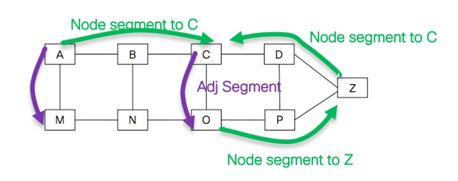

### Building Paths with Segment Lists

The power of Segment Routing comes from **combining** segments into an ordered list — the **segment list** (or SID list). The sender pushes the list onto the packet, and the network executes it step by step.

For example, to route a packet from A to Z via a specific intermediate node M:

```text
Segment list: [M, Z]

A → (shortest path to M) → M → (shortest path to Z) → Z
```

To route a packet from A to Z via a specific link on router R (say, the "east" interface):

```text
Segment list: [R-east-link, Z]

A → (shortest path to R) → R → (east interface) → ... → Z
```


## The SR Domain

The **SR domain** is the set of routers running the same link-state IGP with SR extensions — sharing a common topology database and a common set of SID assignments ([RFC 8402, Section 2](https://www.rfc-editor.org/rfc/rfc8402.html#section-2)). Every node inside the domain has the full topology map and knows every SID in the network, which is what makes source routing possible. The SR domain also serves as a trust boundary within which source routing is permitted; the *SR Domain and Security* section below explains how traffic at the domain's edge is filtered.

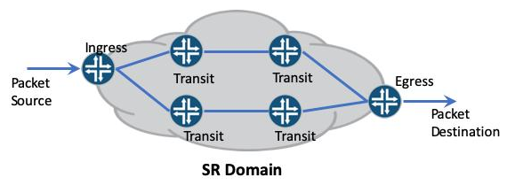

Within the SR domain, each router plays one of three roles on any given packet's journey. These roles are defined in RFC 8402:

- **Source node** (also called the **headend** or **ingress**): The router that creates the segment list and pushes it onto the packet. This is where the "source" in "source routing" happens. The source node decides the path — either by computing it locally from the IGP topology, or by receiving it from an SDN controller — and encodes it as an ordered list of segments. In SR-MPLS this means pushing a label stack; in SRv6 it means adding an outer IPv6 header and, if needed, a Segment Routing Header (SRH).

- **Transit node**: Any router along the path that simply forwards the packet without inspecting the segment list. A transit node performs an ordinary lookup — MPLS label lookup or IPv6 destination-address lookup — and sends the packet on its way. It is completely unaware that the packet is source-routed. This is the property that makes SR deployable over existing infrastructure: transit routers require no software or hardware changes.

- **SR segment endpoint node**: The router identified by the **active segment** — the segment currently being executed (the *Forwarding Model* section below describes the exact mechanism). This router processes the instruction that segment encodes and either advances to the next segment in the list or, if this is the final instruction, delivers the original packet to its destination. Each segment in the list names a different endpoint; a path with three segments visits three endpoint nodes.

A single router can play different roles at different points along the same packet's journey. For example, a router that is a transit node while a packet travels toward one segment endpoint becomes the endpoint node itself when the next segment names it. Readers familiar with the [MPLS primer](MPLS_PRIMER.md#the-mpls-domain) will recognize these roles as the SR equivalents of the MPLS **PE (Provider Edge)** and **P (Provider)** router roles.


## Two Data Planes

In networking, the **control plane** is the set of protocols that discover the topology and compute paths (the IGP, for example), while the **data plane** (also called the forwarding plane) is the hardware and software that actually moves packets based on those decisions. The SR architecture is **independent of the underlying data plane**: the same segment types, policies, and forwarding model apply to both instantiations — only the encoding of segments differs.

### Segment Routing over MPLS (SR-MPLS)

In **SR-MPLS**, each segment is an MPLS label, and the segment list is a standard label stack. Because the label stack sits **outside** the IP header (between Layer 2 and Layer 3), SR-MPLS works regardless of whether the inner packet is IPv4 or IPv6, and existing MPLS forwarding hardware needs no changes. For networks that already run MPLS, SR-MPLS is the natural migration path. The *SR-MPLS* section below covers label assignment, forwarding, and trade-offs in detail.

On an IPv4 network, MPLS is the **only** option for carrying a segment list. The reason is structural: source routing requires space in the packet to encode an ordered list of instructions, and IPv4 has no usable place for one. IPv4 technically has header options, including the original source routing options (LSRR and SSRR from RFC 791). But these are unusable in practice: they force packets onto the CPU slow path on most hardware (the variable-length header prevents fast ASIC (Application-Specific Integrated Circuit) processing), they are filtered by virtually every router and firewall for security reasons, and the entire options field maxes out at 40 bytes — room for roughly 9 IPv4 addresses, far too few for a real segment list.

An MPLS label stack, by contrast, can be as deep as the hardware supports, is processed at line rate by standard MPLS ASICs, and works over any IP version — so for IPv4 networks, SR-MPLS is the only viable choice.

### Segment Routing over IPv6 (SRv6)

IPv6 natively supports **extension headers** — optional headers that give the source a variable-length space to carry forwarding instructions inside the packet.

In **SRv6**, segments are 128-bit IPv6 addresses, and the segment list is carried in the **Segment Routing Header (SRH)**, a specific extension header. Unlike an MPLS label, each SRv6 SID encodes not just a destination but also an action and optional parameters — making SRv6 a network programming framework, as the *SRv6 — Segment Routing over IPv6* section explains in detail.

IPv6 networks can also run SR-MPLS (labels work over any IP version), but SRv6 removes the MPLS dependency entirely, letting the fabric run a single protocol family end to end. **SRv6 is the primary focus of this document.**

### SRv6 versus SR-MPLS — When to Use Which

| Aspect | SR-MPLS | SRv6 |
|--------|---------|------|
| Segment encoding | 20-bit MPLS label in a 4-byte stack entry | 128-bit IPv6 address, or a compressed 16-bit uSID (see *Compressed SIDs* below) |
| Data plane | MPLS | IPv6 |
| Per-segment overhead | 4 bytes | 16 bytes uncompressed; 2 bytes with compressed uSIDs, and zero extra header when the path fits in the destination address (see *Compressed SIDs* below) |
| Encapsulation overhead | None (labels prepended to the existing packet) | 40-byte outer IPv6 header, plus an 8-byte SRH when one is needed |
| Network programming | Limited — labels are opaque numbers | Rich — each SID is address plus function plus argument |
| Transit router changes | None (standard MPLS) | None (standard IPv6 forwarding) |
| Requires an MPLS-capable core | Yes | No |
| Control plane | IS-IS or OSPF with SR extensions | Same |
| Typical deployment | Brownfield service-provider networks that already run MPLS | Greenfield (new-build) data centers, IPv6-native networks, AI fabrics |

SR-MPLS wins on header efficiency and on reusing hardware that is already deployed and paid for. SRv6 wins on programmability and on removing MPLS from the network entirely, so the fabric runs a single protocol family end to end. Compressed SIDs (described under *The Overhead Problem and Compressed SIDs* below) narrow the header-efficiency gap enough that, for many designs, it is no longer the deciding factor.

As of 2026, SR-MPLS remains the dominant deployment in service-provider WANs (Wide Area Networks), where existing MPLS investment is substantial. SRv6 is growing in greenfield data center and cloud environments — particularly AI training fabrics — where there is no MPLS to preserve and the network programming model is worth more than per-byte header efficiency.

### Putting It Together: A Combined Example

Now that both data planes have been introduced, here is a concrete example that brings together prefix segments, adjacency segments, and the SR-MPLS label stack.

The following diagram shows a topology of six routers (R1–R6) with multiple paths between them. R1 wants to send data to R6, but instead of letting the network pick the shortest path on its own, R1 uses Segment Routing to dictate the route. The segment list it pushes onto the packet is `[SID R3, Adj R5, SID R6]`, which reads as three instructions:

1. **SID R3** (Node SID): "Forward toward R3 via the shortest path" — the packet travels R1 → R2 → R3.

2. **Adj R5** (Adjacency SID): "At R3, take the specific link toward R5" — instead of continuing to R4 or any other neighbor, R3 forces the packet out its interface to R5.

3. **SID R6** (Node SID): "Forward toward R6 via the shortest path" — R5 routes the packet to R6.

The diagram below illustrates this using SR-MPLS, where each segment is an MPLS label in a label stack. Notice how the label stack shrinks at each step: R1 pushes all three segments, R3 consumes the first two (its own Node SID and the Adjacency SID), and R5 consumes the last.

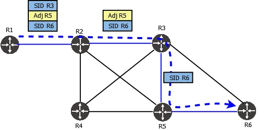

The architecture-level concepts that follow — forwarding model, control modes, policies, and failure handling — apply equally to both data planes. The detailed treatment of SR-MPLS and SRv6 comes after those.


## Forwarding Model

A segment list is processed one instruction at a time. At any point during a packet's journey, exactly one segment is the **active segment** — the instruction currently being executed. The network forwards the packet toward the active segment using ordinary routing. When the packet arrives at the node identified by that segment, the node performs the instruction, advances to the next segment in the list, and forwards the packet onward. This continues until every segment has been processed.

The mechanism for tracking the active segment differs between the two data planes:

- **SR-MPLS:** The active segment is always the **top label** on the MPLS label stack. Processing a segment means popping the top label, which exposes the next one.

- **SRv6:** The active segment is the SID at position `Segments Left` in the Segment Routing Header (SRH), and it is always copied into the IPv6 **Destination Address**. Processing a segment means decrementing Segments Left and copying the next SID into the Destination Address.

In both cases, transit routers between two consecutive segment endpoints do not participate in segment processing at all — they simply forward the packet using their normal lookup (MPLS label lookup or IPv6 destination-address lookup). Only the node that owns the active segment inspects and acts on it.


## Distributed and Centralized Control

SR supports two modes of operation, differing in **who builds the segment lists**:

- **Distributed:** Each ingress router builds its own segment lists from the topology and SIDs it has learned through the IGP. No external controller is involved. This is the simplest deployment model.

- **Centralized (SDN):** A Software-Defined Networking (SDN) controller has a global view of the network topology, traffic demands, and link states. It typically imports the topology from the IGP via **BGP-LS** (Link-State), an extension of **BGP** (Border Gateway Protocol) that exports the IGP's link-state database to external consumers. BGP is the internet's inter-domain routing protocol, but it is also widely used *within* a domain for path and policy distribution. Using this global view, the controller computes optimal segment lists based on constraints the IGP alone does not optimize for — latency, bandwidth, affinity — and programs them onto ingress routers via protocols such as **PCEP** (Path Computation Element Communication Protocol — a protocol for requesting paths from a central path-computation server) or **BGP-SR** (extensions to BGP that distribute SR path information). The *SR Policy* subsection below describes the object these protocols actually install.

The following diagram shows this in action. Routers in the data center and WAN export their topology to the SDN controller via BGP-LS (blue arrows). The controller sees two paths to the peering provider: an upper path (1 Gbps, low latency) and a lower path (10 Gbps, high latency). When an operator requests "500 Mbps over a low-latency path," the controller selects the upper path and programs the corresponding segment list — `[16001, 16003, 16005, PeerSID 166]` — onto the ingress router. The IGP alone would have no way to express that latency preference; the controller's global view is what makes the choice possible.

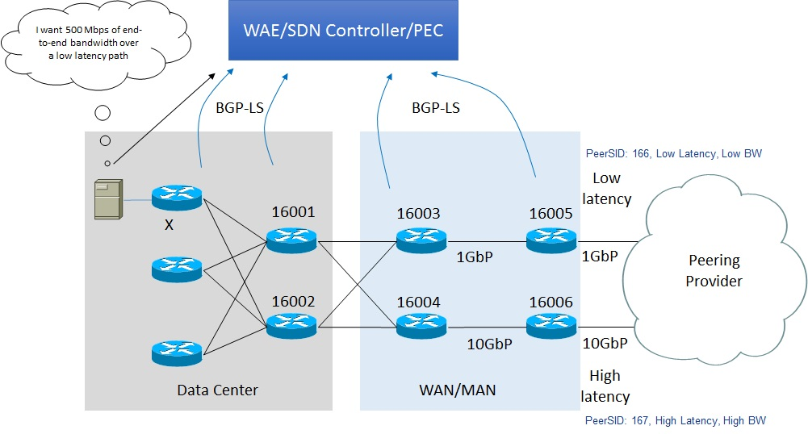

Most production deployments use a **hybrid** approach: distributed IGP for basic reachability and a centralized controller for advanced traffic engineering policies.

> In both modes, the IGP is always running underneath — it provides topology discovery, shortest-path computation, and SID distribution regardless of whether segment lists are built locally or by a controller.


## SR Policy

A segment list on its own is just data. The operational object that an operator or controller actually configures is an **SR Policy**: a named steering rule installed on an ingress router, identified by the triple *(headend, color, endpoint)*.

- **Headend**: the ingress router where the policy lives and where segments are pushed onto packets.
- **Endpoint**: the far end the policy leads to.
- **Color**: an arbitrary numeric tag that distinguishes different intents toward the same endpoint — for example, color 100 for "lowest latency" and color 200 for "avoid the transatlantic link."

A policy holds one or more **candidate paths**, each carrying a segment list. The highest-preference valid candidate is the one in use; the rest stand by as backups. Traffic enters a policy by BGP color (a BGP extended community that maps traffic to a policy's color value), by destination prefix, or by local classification at the headend. The following diagram shows the full hierarchy: each candidate path can itself carry multiple **weighted** segment lists, allowing traffic to be split across several paths at once within a single candidate.

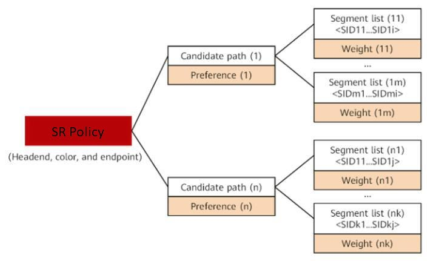

SR Policy is the object that PCEP and BGP-SR (introduced under *Distributed and Centralized Control* above) install on a headend, and it is what "traffic engineering" concretely means in an SR network.

## Binding Segment

A long explicit path can require many segments. That grows the header and can exceed hardware limits on how many segments a router is able to push. A **binding segment**, identified by a **Binding SID (BSID)**, addresses this: it is a single SID that stands in for an entire SR Policy.

When a packet's active segment is a BSID, the router owning it removes that segment and pushes the policy's full segment list in its place. Three benefits follow:

- **Shorter headers.** The upstream router carries one SID instead of ten.
- **Isolation.** Only the router owning the BSID knows the expanded path. If that path is re-optimized, upstream routers are unaffected — they keep sending the same BSID.
- **Stitching.** Policies in different domains chain end to end, each domain hiding its internal path behind a BSID.

A binding segment is therefore not a new kind of forwarding instruction. It is a level of indirection layered over the two basic types.

## Handling Failures: TI-LFA

As described under *Traditional Routing and MPLS Limitations* above, SR eliminates the per-path signaling state that MPLS protocols like RSVP-TE maintained on every transit router. That raises a fair question: if no protocol is tracking the path, what happens when a link along it breaks?

### Why IGP Reconvergence Alone Is Not Enough

The IGP *will* fix the problem — eventually. When a link fails, the IGP goes through a multi-step process:

1. **Detect** the failure (the router notices the link is down).
2. **Flood** an updated link-state advertisement to every router in the area.
3. **Compute** new shortest paths (each router re-runs SPF — the Shortest Path First algorithm, based on Dijkstra's algorithm).
4. **Install** the new paths into the forwarding table — the FIB (Forwarding Information Base), the streamlined lookup table the data plane uses for per-packet decisions.

This process typically takes **1–5 seconds** in a well-tuned network. During that window, every packet that needs the failed link is **dropped** — the router has no valid next hop for it yet. For real-time voice, video, financial transactions, or AI training traffic, even a few hundred milliseconds of packet loss is unacceptable.

**Fast Reroute (FRR)** is the general name for mechanisms that bridge this gap. The idea is to **precompute** a backup path *before* any failure occurs and store it in the forwarding table alongside the primary path. When the link goes down, the router switches to the backup instantly — no flooding, no SPF, no waiting. Once the IGP finishes reconverging (seconds later), the router withdraws the backup and resumes normal forwarding.

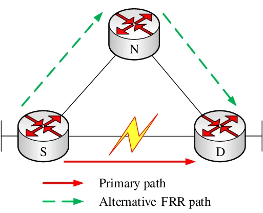

The question, then, is how the router *builds* that precomputed backup path. There are two generations of the answer.

### Classic LFA

**LFA (Loop-Free Alternate)**, defined in [RFC 5286](https://www.rfc-editor.org/rfc/rfc5286.html), is the first-generation approach. When a router detects a link failure, it needs somewhere else to send the affected packets immediately. The only thing it can do without special instructions is hand the packet to one of its **directly connected neighbors** and let that neighbor forward it normally. The neighbor will then use *its own* shortest path to reach the destination.

The catch is that the neighbor's shortest path might route the packet **right back through the failed link** — creating a forwarding loop and a black hole. So the router cannot pick just any neighbor; it must pick one whose shortest path to the destination **naturally avoids** the failure. Such a neighbor is called a "loop-free alternate." Every router in the network has the full topology map from the link-state IGP, so it can check each neighbor's shortest path in advance and identify safe backups before any failure occurs.

The limitation is **coverage**. Because the backup must be a direct neighbor, and that neighbor's *unmodified* shortest path must avoid the failure, many topologies simply have no qualifying neighbor for a given link. The router knows the entire map but can only redirect to the nodes it is physically connected to — and if none of their shortest paths stay clear, there is no backup. In practice, classic LFA covers roughly 40–80% of links depending on the topology. The rest have no protection at all.

### TI-LFA: Full Coverage with Segment Lists

**TI-LFA (Topology-Independent Loop-Free Alternate)**, defined in [RFC 9855](https://www.rfc-editor.org/rfc/rfc9855.html), removes that limitation by changing what the router can express as a backup.

Classic LFA was stuck because the router could only say "send to this neighbor" — and then *hope* the neighbor's shortest path avoided the failure. TI-LFA takes a different approach: instead of relying on any neighbor's shortest path, the router encodes an **explicit backup path as a segment list**. A segment list can steer a packet through any sequence of nodes and links — it is not limited to a single neighbor or a single shortest path. That means TI-LFA can always construct a backup, no matter what the topology looks like. This is what "topology-independent" means: **100% coverage, guaranteed**.

The path TI-LFA encodes is the **post-convergence path** — the exact path the network *would* use after the IGP finishes reconverging (that is, after every router has re-run its shortest-path calculation with the failed link removed from the map). The router computes this path in advance, while everything is still healthy, and stores the resulting segment list as a precomputed backup.

When the failure is detected, the router pushes that backup segment list onto affected packets and forwards them immediately. Because the backup already mirrors the post-convergence path, traffic is on the correct route by the time the IGP finishes reconverging — the transition from backup to normal forwarding is seamless.

> TI-LFA requires Segment Routing. Without the ability to encode an arbitrary path as a segment list, the router has no way to express a multi-hop backup — which is exactly the limitation classic LFA could not escape.

### Example

The following diagram illustrates both mechanisms. The network has eight nodes; the default link metric is 10, except for the two links to PE4, which have a metric of 100. The source (node 1) sends traffic to Dest1 (node 5), and the link between nodes 2 and 3 fails (red star).

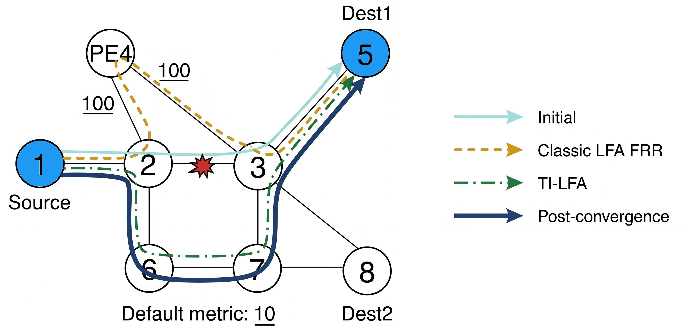

- **Initial path** (solid light blue): 1 → 2 → 3 → 5 — the shortest path before the failure.

- **Classic LFA** (dashed orange): Node 2 checks each of its remaining neighbors — node 1, node 6, and PE4 — to find one whose shortest path to Dest1 avoids the failed 2–3 link:

    - **Node 1**: shortest path is 1 → 2 → 3 → 5, which goes right back through node 2 and the failed link. In other words, sending to node 1 would create a loop.
    - **Node 6**: has *two* equal-cost shortest paths to Dest1: 6 → 2 → 3 → 5 (cost 30, goes through the failed link) and 6 → 7 → 3 → 5 (cost 30, safe). Because ECMP might send the packet along either path, there is no guarantee it avoids the failure. Classic LFA rejects it.
    - **PE4**: shortest path is PE4 → 3 → 5, which does not touch node 2 or the failed link at all. This is a safe loop-free alternate.

    Node 2 reroutes via 2 → PE4 → 3 → 5. The alternate works, but traverses the high-cost PE4 links (metric 100 each), so it is far from optimal. And in other topologies — or for other destinations — no neighbor may qualify at all. That is the coverage gap.

- **TI-LFA** (dash-dot green): Node 2 computes the post-convergence shortest path (the path the network *would* use once the IGP finishes reconverging) and encodes it as a segment list: 2 → 6 → 7 → 3 → 5. This path is guaranteed to avoid the failure and is already optimal.

- **Post-convergence** (solid dark blue): After the IGP fully reconverges (which may take seconds), all routers install updated shortest paths. Traffic now follows 1 → 2 → 6 → 7 → 3 → 5 natively, and the TI-LFA backup is withdrawn. Notice this is the same route TI-LFA precomputed — the only difference is that now node 1 also knows about it.

### Faster Detection with BFD

FRR precomputes the backup path, but the backup is only useful once the router *knows* the link has failed. Physical link failures (a cut fiber, a pulled cable) produce an immediate interface-down signal from the hardware. But many failures are not physical — a remote line card crash, a misconfigured middlebox, or a unidirectional fiber fault can leave the local interface electrically up while the forwarding path is broken. Without a dedicated detection mechanism, the router falls back to the IGP's own hello timer — typically 1–10 seconds — which adds directly to the packet-loss window.

[BFD](https://github.com/ManiAm/BFD-LabNet) (Bidirectional Forwarding Detection), defined in [RFC 5880](https://www.rfc-editor.org/rfc/rfc5880.html), closes this gap. Two neighbors exchange lightweight probe packets at a configured interval — as fast as every 30 milliseconds on modern hardware. If a configured number of consecutive probes go unanswered, BFD declares the link down and notifies the IGP and the FRR mechanism. BFD is a **detection** protocol, not a recovery protocol — it tells the router *that* the path failed; FRR tells it *where* to send traffic instead.

The following timeline shows how BFD and FRR work together:

| Time           | Event |
|----------------|-------|
| t₀             | Link fails |
| t₁ (~30–50 ms) | BFD detects the failure (or hardware signals interface-down for a physical break) |
| t₂ (~50 ms)    | FRR activates the precomputed backup path — packets flow again |
| t₃ (~1–5 s)    | IGP reconverges: flood + SPF + FIB update complete across the network |
| t₄             | Normal forwarding resumes on the new shortest path; the FRR backup is withdrawn |

Without FRR, packets are lost from t₀ all the way to t₃. With FRR, the loss window is only t₀ to t₂ — typically under 50 milliseconds.

## SR-MPLS

SR-MPLS applies the Segment Routing architecture to the MPLS data plane. Segments are encoded as ordinary MPLS labels, and a segment list is simply an MPLS label stack — one 4-byte entry per segment. The existing MPLS forwarding hardware is reused without modification; only the control plane changes, with IGP extensions replacing LDP and RSVP-TE.

### Label Assignment and the SRGB

Each router reserves a contiguous range of MPLS labels called the **Segment Routing Global Block (SRGB)** — for example, labels 16,000–23,999. A Prefix SID is advertised as an **index** (not an absolute label value), and every router computes the actual label by adding the index to the start of its own SRGB. For example, if a router advertises Prefix SID index 10 and a neighboring router's SRGB starts at 16,000, that neighbor uses label 16,010 to forward traffic toward the advertising router. Because every router in the domain uses the same index, the mapping is globally consistent even if different routers use different SRGB ranges.

The SRGB sits within each router's full MPLS label space (labels 0 to 1,048,575 — the 20-bit range). A typical layout using the common vendor-default SRGB of 16,000–23,999:

| Range | Purpose |
|-------|---------|
| 0–15 | Reserved by the IETF ([RFC 3032](https://www.rfc-editor.org/rfc/rfc3032.html)) for special labels — implicit-null, explicit-null, router-alert, etc. |
| 16–15,999 | Available for other uses — LDP, RSVP-TE, static assignments |
| **16,000–23,999** | **SRGB** — reserved for Segment Routing Prefix SIDs. This range is operator-configured; 16,000–23,999 is not mandated by any RFC but is a common vendor default. |
| 24,000–1,048,575 | Remaining label space — used for Adjacency SIDs, dynamically allocated local labels, and other protocols |

Only the first 16 labels are fixed by the standard. The SRGB boundaries and everything around them are chosen by the operator, so the ranges above are illustrative, not mandatory.

The following diagram shows this in practice. Each table represents one router's label space, with the SRGB highlighted in blue. Router D advertises its loopback `10.1.1.65/32` with Prefix SID index 65. All three transit routers (A, B, C) share the same SRGB starting at 16,000, so each one computes the same label: 16,000 + 65 = **16,065**. The packet travels from A to D carrying label 16,065 at every hop. At router C — the last hop before the destination — the label is popped and the bare payload is delivered to D.

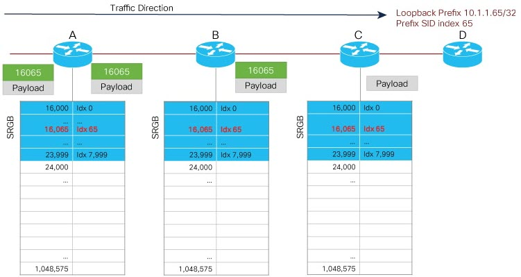

Adjacency SIDs, by contrast, are allocated from outside the SRGB. They are locally significant labels — meaningful only on the router that advertises them.

### Forwarding

The forwarding model is the MPLS label-stack processing described in the [MPLS primer](MPLS_PRIMER.md#label-operations-and-the-lsp). At the ingress, the segment list is pushed as a stack of MPLS labels — one label per segment. Each transit router pops or swaps the top label according to its LFIB (Label Forwarding Information Base) entry, which is now populated by the IGP's SR extensions rather than by LDP or RSVP-TE. The data-plane mechanics are identical to traditional MPLS; only the control-plane source of the label bindings has changed.

### Advantages and Limitations

**Advantage:** Immediate deployment on existing MPLS-capable hardware. This makes SR-MPLS attractive for **brownfield** networks (networks with pre-existing infrastructure) — particularly service-provider WANs that already run MPLS.

**Limitation:** MPLS labels are opaque numbers — they carry no inherent meaning beyond the SID assignment. There is no way to encode a "function" or "argument" into a label the way SRv6 does with its SID structure (see *SRv6 — Segment Routing over IPv6* below). Additionally, deep segment lists increase the label stack depth, which some older hardware may not support.


## SRv6 — Segment Routing over IPv6

SRv6 is the instantiation of Segment Routing on the IPv6 data plane. Instead of MPLS labels, SRv6 uses **IPv6 addresses as instructions**. This is a conceptual shift: an SRv6 Segment Identifier (SID) is not just an address that says "where to go" — it is a programmable instruction that says "what to do."

Before SRv6, networks accumulated multiple overlay and tunneling protocols — MPLS for label switching, VXLAN for data-center overlays, NSH (Network Service Header) for service chaining, separate VPN encapsulations — each with its own control plane and packet format layered between Ethernet and IP. SRv6 eliminates them all by encoding forwarding instructions, VPN context, and service functions directly into the IPv6 header. The result is a return to a clean protocol stack: just Ethernet, IPv6, transport, and data.

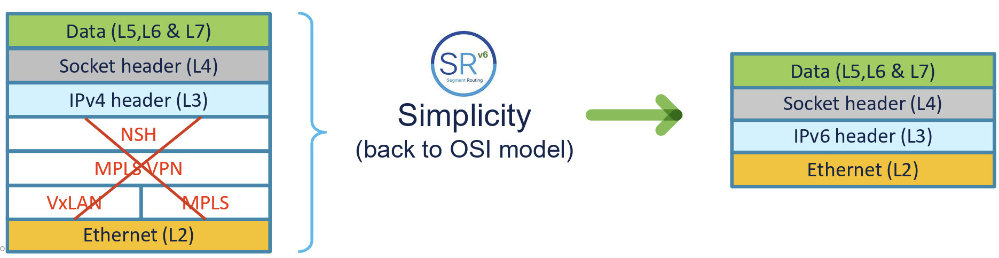

### Why IPv6: Extension Headers

SRv6 is possible because IPv6 was designed with extensibility as a first-class principle. Unlike IPv4 (where header options exist but are rarely used due to performance penalties), IPv6 defines **Extension Headers** — optional headers inserted between the fixed 40-byte IPv6 header and the upper-layer payload (TCP, UDP, etc.).

Extension headers form a chain. The fixed IPv6 header contains a **Next Header** field that identifies the first extension header (or the upper-layer protocol if there are none), and each extension header contains its own Next Header field pointing to whatever follows it. This chain lets the source attach multiple instructions to a single packet without changing the fixed header's size or layout.

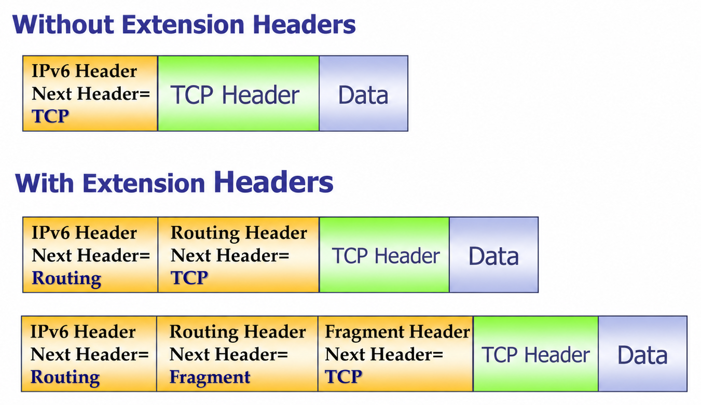

Transit routers typically skip the entire extension-header chain — they forward on the destination address alone. This is why extension headers do not slow down intermediate hops: the variable-length instruction space is invisible to every router except the one that needs to act on it.

Among the standard extension header types, the one SRv6 builds on is the **Routing Header**. A Routing Header lets the source specify a list of intermediate nodes the packet must visit — exactly the capability Segment Routing needs. The SRv6-specific variant is the **Segment Routing Header (SRH)**, identified as Routing Type 4. It carries the segment list (the ordered sequence of SRv6 SIDs) and a pointer to the currently active segment. The *Segment Routing Header (SRH)* section below details its internal fields and processing rules.


### The SRv6 SID Structure

Every SRv6 SID is a 128-bit IPv6 address, but it is not treated as one flat number. It is read as three fields — *who* owns the instruction, *what* the instruction is, and *any parameters* it takes:

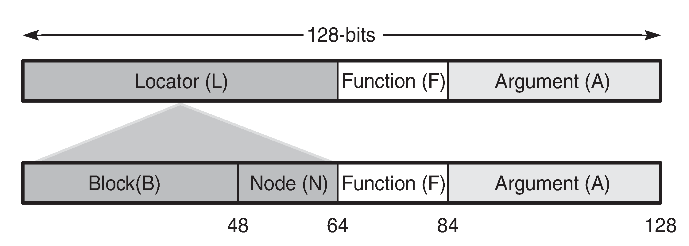

- **Locator** (B + N bits): The routable prefix identifying the node that owns this SID (the *SR segment endpoint*). It splits into a **Block** — the prefix shared by every node in the SR domain — and a **Node** part identifying one specific node inside that block. The Locator is advertised by the IGP, so any router can forward a packet toward it using ordinary IPv6 routing.

- **Function** (F bits): An opcode telling the owning node what to do with the packet — forward out a specific interface, decapsulate, look the inner packet up in a particular VPN (Virtual Private Network) table, and so on. The standard opcodes are listed under *SRv6 Endpoint Behaviors* below.

- **Argument** (A bits, optional): Parameters for the function — for example a flow identifier or a **VRF** (Virtual Routing and Forwarding) table index. A VRF is an isolated routing table that lets one physical router maintain several independent routing contexts, typically to keep different tenants or services separate.

The field widths are not fixed by the standard; each operator chooses them. A common choice is a 48-bit Block, 16-bit Node, and 16-bit Function.

This structure is what makes SRv6 a "network programming" framework ([RFC 8986](https://www.rfc-editor.org/rfc/rfc8986.html)): each SID is simultaneously a routable address *and* an executable instruction. That dual nature is the single most important idea in SRv6, and everything in the rest of this section follows from it.

### The Segment Routing Header (SRH)

When a packet needs to traverse more than one segment, the full segment list is carried in the **Segment Routing Header (SRH)**, an IPv6 Routing Extension Header (type 4) defined in [RFC 8754](https://www.rfc-editor.org/rfc/rfc8754.html).

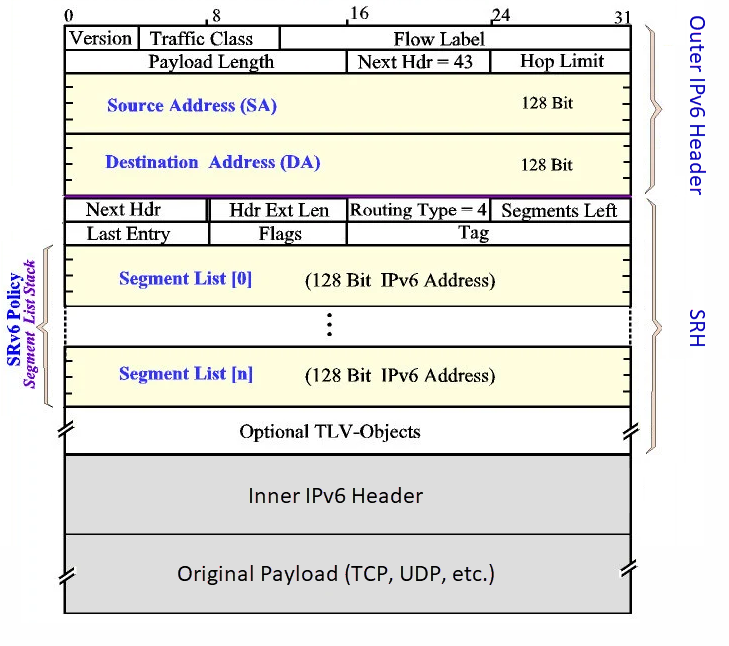

The diagram shows the SRH layout. The first two rows are the 8-byte fixed portion; the segment list follows, at 16 bytes per SID. Key fields:

- **Next Header**: Identifies what follows the SRH — the inner IPv6 header, TCP, UDP, and so on. This is the standard IPv6 extension-header chaining field.

- **Hdr Ext Len**: The length of the SRH in 8-byte units, excluding the first 8 bytes.

- **Segments Left (SL)**: A pointer (index) into the segment list, indicating the **active segment** (introduced under *Forwarding Model* above). It starts at `n` (the highest index) and decrements toward 0 at each segment endpoint.

- **Last Entry**: The index of the last element in the segment list (equal to `n`).

- **Flags** and **Tag**: One byte of flags plus a two-byte operator-defined tag used to mark a group of packets as belonging to the same class. Neither affects forwarding.

- **Segment List**: An array of 128-bit SIDs stored in **reverse order** — `Segment List[0]` is the *last* SID to visit (the final destination), and `Segment List[n]` is the *first*. The reversal exists so that Segments Left can simply count down to zero as the packet advances, which is cheaper for hardware than counting up against a variable limit.

The IPv6 **Destination Address** always contains the active SID — that is, `Segment List[Segments Left]`. This is the fundamental invariant that makes SRv6 work with unmodified transit routers: they forward on the destination address exactly as they would for any other IPv6 packet, and never need to look at the SRH.

An SRH is only required when a path has **more than one** segment. If the whole instruction fits in the destination address, the packet carries no SRH at all — a property that the *Compressed SIDs (uSIDs)* section exploits heavily.

### SRv6 Encapsulation: Why Two Headers?

Transit routers forward packets based on the IPv6 Destination Address — and nothing else. They do not look inside the SRH. So for a packet to reach the next segment endpoint, that endpoint's SID must be sitting in the Destination Address field. And since the packet visits multiple endpoints in sequence, the Destination Address must change at every stop — each endpoint copies the next SID from the segment list into the Destination Address before forwarding.

That creates a problem. Suppose the original packet is headed for a server at `2001:db8::99`. When the Source pushes a segment list and sets the Destination Address to the first segment (S1), the original destination `2001:db8::99` has nowhere to go — the Destination Address field can hold only one address, and S1 just took it. By the time the packet reaches the final segment endpoint, the Destination Address has been overwritten multiple times, and the real destination is lost.

The solution is **encapsulation**: wrap the original packet inside a new outer IPv6 header before adding the SRH.

```text
┌───────────────────────────────────────┐
│ Outer IPv6 Header                     │ ← DA = active SID (changes at each hop)
├───────────────────────────────────────┤
│ SRH (Segment Routing Header)          │ ← segment list + Segments Left pointer
├───────────────────────────────────────┤
│ Inner IPv6 Header                     │ ← DA = real destination (untouched)
├───────────────────────────────────────┤
│ Original payload (TCP, UDP, etc.)     │
└───────────────────────────────────────┘
```

Think of it like putting a letter (the original packet) inside a new envelope (the outer header). The postal system reads and stamps the outer envelope at every stop along the route. The letter inside is never opened until the final stop, where the last segment endpoint strips the envelope and delivers the original letter.

- **Outer IPv6 header**: The disposable envelope. Its Destination Address carries the active SID and is overwritten at every segment endpoint. The SRH is attached to this header.

- **Inner IPv6 header**: The original packet, preserved unchanged. Its Destination Address is the real final destination. It stays untouched until the last segment endpoint strips the outer header and delivers it.

This is the same principle as any IP tunnel (GRE, VXLAN, and so on): one header is sacrificed for routing, while the other protects the original payload. The cost is 40 bytes — one IPv6 header — on every packet.

### SRv6 Endpoint Behaviors

[RFC 8986](https://www.rfc-editor.org/rfc/rfc8986.html) defines the **SRv6 Network Programming** model: the set of standard behaviors that a Function value can select. These are the opcodes referenced earlier in the SID structure. The most common ones:

| Behavior | What it does | SR concept it implements |
|----------|--------------|--------------------------|
| **End** | Decrement Segments Left, copy the next SID into the Destination Address, forward toward it. The basic "advance to the next segment" instruction. | Prefix segment (Node SID) |
| **End.X** | Same as End, but forward out one specific interface instead of following the shortest path. | Adjacency segment |
| **End.DT4 / End.DT6** | Decapsulate, then look the inner IPv4 or IPv6 packet up in a specific VRF. | L3 VPN egress |
| **End.DX4 / End.DX6** | Decapsulate, then forward the inner packet straight out a specific interface. | Cross-connect to a customer edge |
| **End.B6.Encaps** | Push a new IPv6 header and SRH carrying another segment list. | Binding segment |

The names are systematic once you know the letters: **`D`** means "decapsulate first," **`X`** means "send out a specific interface," and **`T`** means "look up in a routing table." So `End.DX6` reads as "decapsulate, then send out an interface, IPv6," and `End.DT6` as "decapsulate, then do an IPv6 table lookup."

These behaviors are the instruction set of the SRv6 network program: each SID encodes one instruction, and the segment list is the program. Because a behavior can be any packet operation the node supports, SRv6 can express services — firewalling, load balancing, VPN termination — as ordinary segments in the path rather than as separate middlebox plumbing.

### SRv6 Packet Walk — Step by Step

This section applies the general forwarding model from *Forwarding Model* above to the SRv6 data plane with a concrete example, demonstrating the encapsulation just described in action.

The network has four routers: a **Source**, and three SR segment endpoints named **S1**, **S2**, and **S3**. The Source wants to send a packet to S3, but instead of letting the network choose the path, it uses SRv6 to dictate that the packet must visit S1 and S2 along the way. It encodes this intent as a segment list with three instructions:

- **S1** — an `End` SID: "go to S1 first"
- **S2** — an `End` SID: "then go to S2"
- **S3** — an `End.DT6` SID: "finally, arrive at S3 and decapsulate"

Other routers may exist between these four, but they are just transit nodes — they forward the packet without knowing anything about the segment list.

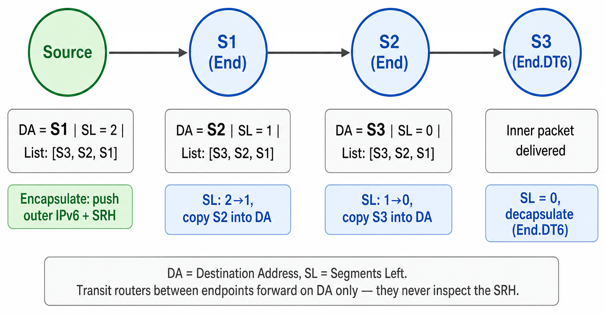

**At the Source node:**

The Source encapsulates the original packet inside an outer IPv6 header and appends the SRH, as described in *SRv6 Encapsulation* above. The outer Destination Address is set to S1 — the first segment to visit:

```text
IPv6 Destination Address = S1     (first segment to visit)
SRH:
  Segments Left = 2
  Segment List[0] = S3            (final destination)
  Segment List[1] = S2
  Segment List[2] = S1            (first segment — pointed to by SL=2)
```

**At node S1** (SR segment endpoint):

1. The node sees it is the destination (the Destination Address matches one of its SIDs).
2. It decrements Segments Left: `SL = 2 → 1`.
3. It copies `Segment List[1]` (which is S2) into the IPv6 Destination Address.
4. It forwards the packet toward S2.

**At node S2:**

1. Same process: `SL = 1 → 0`.
2. Copies `Segment List[0]` (which is S3) into the Destination Address.
3. Forwards toward S3.

**At node S3:**

1. `SL = 0` — this is the final segment, and the SID's function is a decapsulation behavior.
2. The node strips the outer IPv6 header and the SRH, then delivers the original inner packet according to that behavior — for `End.DT6`, by looking it up in the associated VRF.

Notice that throughout this entire journey, the **segment list inside the SRH never changes**. All three entries — S1, S2, S3 — are present from the Source all the way to S3. What changes at each endpoint is only the **Segments Left** pointer (decremented by 1) and the **Destination Address** (overwritten with the next SID from the list). The segment list is like a printed itinerary: every endpoint node reads from the same page; only the "you are here" marker advances. This is also what makes SRv6 different from SR-MPLS, where each hop pops a label off the stack, physically shrinking it. In SRv6, the SRH is carried intact and only removed at the very end by the final endpoint's decapsulation behavior.

**Transit routers** (any router between S1 and S2, or between S2 and S3) do not examine the SRH at all. They see a normal IPv6 packet with a destination address and forward it using standard routing. This is why SRv6 is transparent to non-participating nodes and works over unmodified transit infrastructure.

### The SR Domain and Security

The [MPLS primer](MPLS_PRIMER.md#source-routing-the-alternative) noted that IPv4 source routing was ultimately filtered out of the internet on security grounds: it let an outsider dictate a path through someone else's network, bypassing firewalls and amplifying traffic. SRv6 is source routing, so why is it not the same problem?

The answer is that SRv6 is defined to operate only inside the **SR domain**. RFC 8754 requires two things at the domain boundary:

- **Ingress filtering.** Packets arriving from outside the domain that are destined to an internal SID must be dropped. An outsider therefore cannot inject a segment list into the fabric.
- **SID address separation.** SIDs are allocated from address space that is not advertised outside the domain, so external traffic cannot even address them.

Within the domain, the operator already controls every node, so a source-routed packet grants no privilege the sender did not already have. SRv6 is thus source routing with a trust boundary, which is precisely what the IPv4 options lacked.

This same boundary explains a practical deployment note: some networks drop IPv6 packets carrying unfamiliar extension headers. Because SRH-bearing packets stay inside the SR domain and are decapsulated before leaving it, this does not affect traffic on the public internet.


## The Overhead Problem and Compressed SIDs (uSIDs)

### The Problem

There is an obvious cost to SRv6: each segment in the list is a **128-bit IPv6 address**, or 16 bytes. Take a 5-segment path:

| Component | Bytes |
|---|---|
| SRH fixed portion | 8 |
| 5 SIDs × 16 bytes | 80 |
| **SRH total** | **88** |
| Outer IPv6 header (encapsulation mode) | 40 |
| **Total added per packet** | **128** |

By comparison, the same 5-segment path in SR-MPLS costs 5 × 4 = **20 bytes** of label stack.

For a 9000-byte jumbo frame, 128 bytes is noise. For the small control and telemetry packets common in data center and AI fabrics — often a few hundred bytes — it is a double-digit percentage of the packet, wasting link bandwidth and consuming scarce switch buffer space. This gap was the main practical objection to SRv6 in high-speed environments, and it is what compressed SIDs were designed to close.

### The Solution: Micro-Segment IDs (uSIDs)

**Micro-Segment IDs (uSIDs)** — called Compressed SIDs (C-SIDs) in the standard — are defined in [RFC 9800](https://www.rfc-editor.org/rfc/rfc9800.html), published in June 2025. The idea is to stop wasting a whole 128-bit slot on a single instruction. Instead, a **uSID container** packs several short identifiers into one 128-bit address:

```text
128-bit uSID Container (F3216 format):

|<-- 32 bits -->|<- 16b ->|<- 16b ->|<- 16b ->|<- 16b ->|<- 16b ->|<- 16b ->|
|  Locator Block|  uSID1  |  uSID2  |  uSID3  |  uSID4  |  uSID5  |  uSID6  |
```

- **Locator Block** (32 bits): The shared prefix portion of the Locator from the *SRv6 SID Structure* above — specifically, the Block (B) field. Every node in the SR domain shares this prefix — for example `5f00::/32`, taken from the SRv6 SID space that [RFC 9602](https://www.rfc-editor.org/rfc/rfc9602.html) reserves at `5f00::/16`.

- **uSID** (16 bits each): One compressed node or function identifier — one hop or one instruction. A container has room for up to **6** uSIDs (6 × 16 = 96 bits, plus the 32-bit Locator Block = 128 bits).

- **End-of-Container** (`0x0000`): Any unused positions are filled with `0x0000`. The first `0x0000` tells the processing node there are no more uSIDs in this container. If all 6 slots are occupied, the shift-and-lookup mechanism (described below) naturally produces `0x0000` after the last uSID is shifted out, so the end-of-container condition is always detected.

The name **F3216** describes the layout: a 32-bit Locator Block with 16-bit uSIDs. Other splits are legal (F4816, for instance), but F3216 is the common deployment choice, and 32 + 6 × 16 = 128 bits exactly.

Crucially, this is not a new packet format. The container is a perfectly ordinary SRv6 SID as described in *SRv6 — Segment Routing over IPv6* above: the Locator Block plus `uSID1` form the owning node's Locator and Function, and `uSID2` through `uSID6` sit in the Argument field. Transit routers that know nothing about uSIDs still forward it correctly, because it is still just an IPv6 address with a matching route.

With six uSIDs per container, a path of up to six hops fits entirely in the **IPv6 destination address** — no SRH at all. Longer paths chain additional containers in an SRH, at 16 bytes per six hops instead of 16 bytes per hop.

The following diagram shows both the uSID container layout and its effect on the actual packet. On the left, the F3216 format is broken down with a 5-uSID example: Locator Block `2001:0db8` followed by five uSIDs (`0100` through `0500`) and an End-of-Container marker in the 6th slot (`0000`) — a 6th real uSID could occupy that slot if the path were one hop longer. On the right, two packets carrying the same 5-hop path are compared side by side — the uncompressed version (top) needs an outer IPv6 header **plus** an SRH with five 128-bit segment entries, while the uSID version (bottom) packs all five hops into the destination address and carries **no SRH**, going directly from the outer IPv6 header to the inner payload:

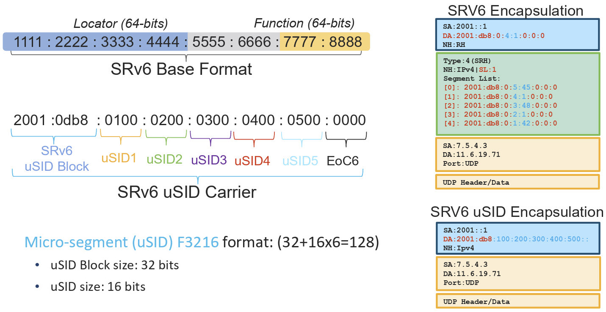

RFC 9800 defines two compression flavors. **NEXT-CSID** — the one described here and the one used in practice — makes every container a self-contained SID. **REPLACE-CSID** carries the Locator Block only in the first container and packs raw uSIDs into the rest, saving a few more bytes on very long paths at the cost of more complex processing. The remainder of this document deals with NEXT-CSID.

### uSID Forwarding: Shift-and-Lookup

The forwarding behavior for uSIDs is elegantly simple. At each hop, the switch performs a **shift-and-lookup** operation:

1. **Match**: The switch recognizes the Locator Block + its own uSID at the leading position (combined, this forms a /48 prefix).
2. **Shift**: All uSIDs are left-shifted by 16 bits. The next uSID moves into the leading position. A zero fills the vacated slot at the end.
3. **Lookup**: The switch performs a /48 route lookup on the updated address (Locator Block + new leading uSID) and forwards out the corresponding port.

This is the **uN (micro-node)** behavior, the uSID equivalent of End. Note that the lookup is a plain longest-prefix match on a /48 route — exactly what any IPv6 switch ASIC already does at line rate. The only new capability required is the 16-bit shift.

#### Example: 3-Hop Path

Suppose a packet must traverse switches R1, R2, and R3, with uSIDs `0x000A`, `0x000B`, and `0x000C` respectively, under Locator Block `5f00:0000`:

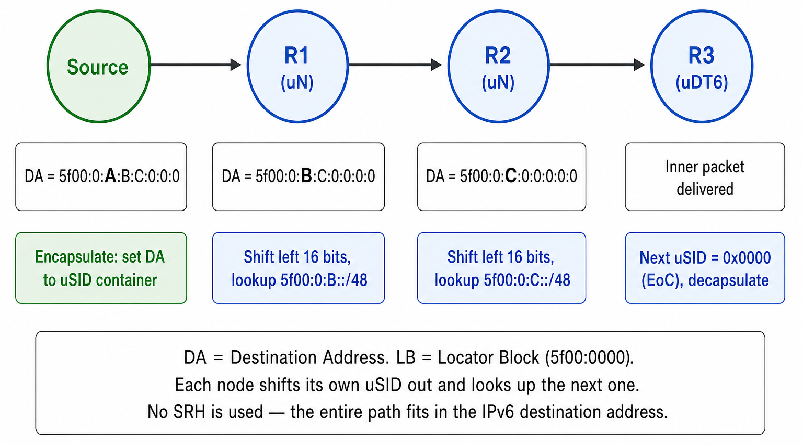

**Initial destination address:**
```text
5f00:0000:000A:000B:000C:0000:0000:0000
^^^^^^^^^ ^^^^ ^^^^ ^^^^ ^^^^^^^^^^^^^
    LB     R1   R2   R3  end-of-container
```

`LB` is the 32-bit Locator Block (`5f00:0000`); the trailing zeros mark the end of the uSID list.

**At R1** (uSID = `0x000A`):
- Match: `5f00:0000:000A::/48` — that's me.
- Shift: Left-shift the uSID portion by 16 bits (the Locator Block stays in place).
- New DA: `5f00:0000:000B:000C:0000:0000:0000:0000`
- Lookup: `5f00:0000:000B::/48` → forward to R2.

**At R2** (uSID = `0x000B`):
- Match: `5f00:0000:000B::/48` — that's me.
- Shift: Left-shift the uSID portion by 16 bits.
- New DA: `5f00:0000:000C:0000:0000:0000:0000:0000`
- Lookup: `5f00:0000:000C::/48` → forward to R3.

**At R3** (uSID = `0x000C`):
- Match: `5f00:0000:000C::/48` — that's me.
- Shift: the next position is `0x0000`, the End-of-Container marker, so there is no further uSID to shift in.
- This is therefore the final hop: R3 decapsulates and delivers the inner packet.

The entire three-hop path traveled in a single 128-bit address. No SRH was needed, so uSIDs added **no bytes at all** beyond the outer IPv6 header that the encapsulation already required — compared with 8 + 3 × 16 = 56 bytes of SRH for the uncompressed equivalent.

> **Note:** The example gives R3 a plain uN uSID and says it "decapsulates," but uN itself does not include decapsulation. In a real deployment, the final uSID would be a **uDT** or **uDX** SID (described in *uSID Behaviors* below) whose function includes decapsulation. The End-of-Container marker (`0x0000`) tells the node it has reached the final instruction, and the function field tells it what to do there.

### uSID Behaviors

The uSID behaviors mirror the uncompressed behaviors from *SRv6 Endpoint Behaviors* above, each adapted to shift the container instead of advancing an SRH index:

| uSID behavior | Uncompressed equivalent | Operation | Purpose |
|---------------|------------------------|-----------|---------|
| **uN** | End | Shift-and-lookup | Forward to a node via the shortest path |
| **uA** | End.X | Shift-and-cross-connect | Forward out a specific interface on a node |
| **uDT4 / uDT6** | End.DT4 / End.DT6 | Decapsulate, VRF lookup | Terminate the path and deliver into a VPN table |
| **uDX4 / uDX6** | End.DX4 / End.DX6 | Decapsulate, forward out interface | Terminate the path onto a specific link |

**uN** is by far the most common; it is what every intermediate hop uses. **uA** adds egress-interface selection at a hop, which matters when several parallel links connect the same pair of nodes and the sender must choose between them. The **uDT** and **uDX** behaviors appear only at the last hop.


## History

| Year | Milestone |
|------|-----------|
| 2012–2013 | Clarence Filsfils (Cisco Fellow) and collaborators formalize the Segment Routing concept to address MPLS control-plane scalability |
| 2013 | IETF creates the SPRING (Source Packet Routing in Networking) working group to standardize SR |
| 2014–2016 | SR-MPLS specifications mature; vendors ship implementations |
| 2017–2021 | SRv6 specifications develop through the IETF: RFC 8402 (SR Architecture, 2018), RFC 8754 (SRH, 2020), and RFC 8986 (Network Programming, 2021) |
| 2020–2024 | Large-scale SRv6 deployments by service providers and hyperscalers (SoftBank, LINE, China Mobile, among others) for 5G transport and SD-WAN (Software-Defined Wide Area Network) |
| June 2025 | RFC 9800 standardizes compressed segment lists (uSIDs), closing most of the header-overhead gap with SR-MPLS |
| 2026 | The OCP (Open Compute Project) MRC (Multipath Reliable Connection) 1.0 specification defines SRv6 uSID source routing as a routing mode for AI cluster fabrics |


## Summary

The path from traditional IP routing to SRv6 is a sequence of trades, each one buying control and giving up something else:

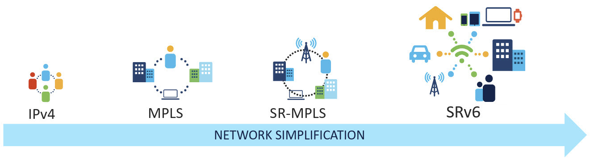

| Era | Approach | Trade-off |
|-----|----------|-----------|
| Traditional IP | Destination-based, hop-by-hop | Simple, but the sender has no control over the path |
| MPLS + RSVP-TE | Signaled label-switched explicit paths | Full path control, at the cost of per-tunnel state on every transit router and three control-plane protocols |
| SR-MPLS | Source-routed label stacks distributed by the IGP | Path control with a stateless core and no new signaling protocol; still requires an MPLS data plane |
| SRv6 | Source-routed IPv6 addresses carried in the SRH | No MPLS dependency and full network programmability, at 16 bytes per segment |
| SRv6 + uSIDs | Six segments packed into one IPv6 address | Keeps SRv6's programmability while cutting the header cost to roughly SR-MPLS levels — often to nothing |

Three ideas carry through all of it. The path lives **in the packet**, not in the routers, which is what keeps the core stateless. A segment is an **instruction**, not merely an address, which is what lets SRv6 express services and not just topology. And **transit routers need no changes**, which is what made each step deployable in the first place.


## Key RFCs and References

| RFC            | Title | Role |
|----------------|-------|------|
| [RFC 8402](https://www.rfc-editor.org/rfc/rfc8402.html) | Segment Routing Architecture | Defines the core SR concepts: segments, segment lists, prefix and adjacency segments |
| [RFC 8754](https://www.rfc-editor.org/rfc/rfc8754.html) | IPv6 Segment Routing Header (SRH) | Defines the SRH format, packet processing, and transit/endpoint behavior |
| [RFC 8986](https://www.rfc-editor.org/rfc/rfc8986.html) | SRv6 Network Programming | Defines endpoint behaviors (End, End.X, End.DT4, etc.) and the SID structure (Locator, Function, Argument) |
| [RFC 9352](https://www.rfc-editor.org/rfc/rfc9352.html) | IS-IS Extensions to Support Segment Routing over the IPv6 Data Plane | Defines the IS-IS TLVs that advertise SRv6 Locators and SIDs |
| [RFC 9513](https://www.rfc-editor.org/rfc/rfc9513.html) | OSPFv3 Extensions for Segment Routing over IPv6 (SRv6) | The OSPFv3 equivalent of RFC 9352 |
| [RFC 5286](https://www.rfc-editor.org/rfc/rfc5286.html) | Basic Specification for IP Fast Reroute: Loop-Free Alternates | Defines classic LFA — the first-generation fast-reroute mechanism for IP networks |
| [RFC 5880](https://www.rfc-editor.org/rfc/rfc5880.html) | Bidirectional Forwarding Detection (BFD) | Defines the BFD protocol used for fast failure detection on links and paths |
| [RFC 9602](https://www.rfc-editor.org/rfc/rfc9602.html) | Segment Routing over IPv6 (SRv6) Segment Identifiers in the IPv6 Addressing Architecture | Reserves the `5f00::/16` address block for SRv6 SIDs |
| [RFC 9800](https://www.rfc-editor.org/rfc/rfc9800.html) | Compressed SRv6 Segment List Encoding | Defines uSIDs (compressed SIDs), the NEXT-CSID and REPLACE-CSID flavors, and the shift-and-lookup forwarding model |
| [RFC 9855](https://www.rfc-editor.org/rfc/rfc9855.html) | Topology-Independent Fast Reroute Using Segment Routing | Defines TI-LFA — 100% coverage fast reroute using precomputed segment lists |
